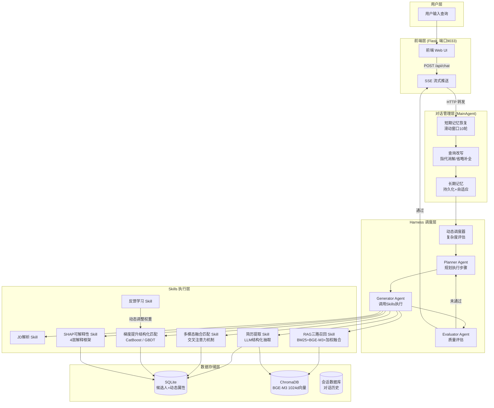
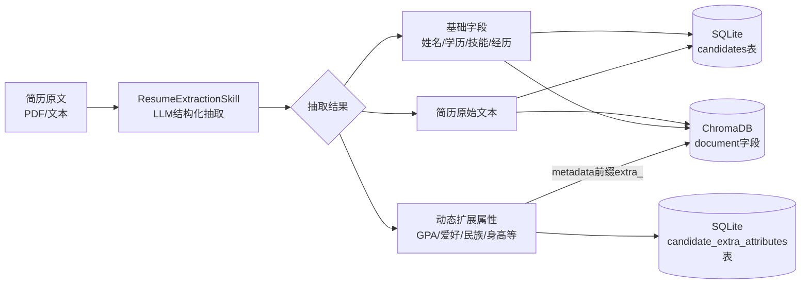

# Harness-Driven Multimodal Hierarchical Fusion Intelligent Recruitment Matching System

## 基于Harness驱动的多模态分层融合智能招聘匹配系统

### 系统概述

本系统是一个创新性的AI驱动智能招聘匹配平台，基于Harness Engineering 2026的"生成-评估"分离架构，结合LangGraph多Agent协作和多模态分层融合技术，实现了高精度、可解释的人岗智能匹配。

### 三大核心创新

1. **反馈驱动的动态调度机制 (Feedback-Driven Dynamic Scheduling)**
   - 基于查询复杂度评估的自适应任务分解
   - 用户反馈驱动的质量阈值动态调整
   - Planner→Generator→Evaluator三阶段迭代优化

2. **多模态分层融合匹配 (Multimodal Hierarchical Fusion Matching)**
   - BGE-M3 1024维文本特征 + BLIP-base 768维真实图像特征（原设计为BLIP-3-7B，因transformers 5.x不兼容回退）
   - 交叉注意力机制融合至1024维联合表示
   - 梯度提升决策树 12维结构化特征补充匹配（首选 CatBoost；在无 CatBoost wheel 的环境下自动回退为 scikit-learn GradientBoosting 真实训练）

3. **层次化SHAP可解释性框架 (Layered SHAP Explainability)**
   - Layer 1: 全局特征重要性柱状图
   - Layer 2: 个体SHAP瀑布图
   - Layer 3: 前3对特征交互贡献度
   - Layer 4: 自然语言解释（简洁/详细版）

### 技术栈

| 组件 | 技术 | 版本 |
|------|------|------|
| LLM调用 | LongCat API (OpenAI兼容) | - |
| 多Agent编排 | LangGraph | 0.2.15 |
| 向量数据库 | ChromaDB | 0.5.11 |
| 结构化数据库 | SQLite | 3.45.0 |
| 结构化匹配 | CatBoost / scikit-learn GradientBoosting（回退） | 1.2.5 / 1.9.0 |
| 文本嵌入 | BGE-M3 (本地) | 1024d |
| 图像特征 | BLIP-base (真实视觉推理) | 768d |
| 可解释性 | SHAP | 0.44+ |
| 后端框架 | FastAPI + Uvicorn | 0.109+ |
| 前端框架 | Flask | 3.0+ |
| 测试框架 | Pytest | 8.0+ |

### 项目结构

```
hr_agent_mt/
├── models/                      # 本地模型目录（不入库，需自行下载）
│   └── bge-m3/                  # BGE-M3嵌入模型（1024d, ~2.2GB）
├── backend/
│   ├── config.py                 # 全局配置
│   ├── models/
│   │   ├── longcat_client.py     # LongCat LLM API客户端
│   │   ├── multimodal_fusion.py  # 多模态分层融合模型
│   │   └── catboost_matcher.py   # CatBoost结构化匹配
│   ├── harness/
│   │   ├── state.py              # 任务状态定义
│   │   ├── dynamic_scheduler.py  # 动态调度器(创新点1)
│   │   └── harness.py            # Harness控制器
│   ├── agents/
│   │   ├── planner_agent.py      # 规划Agent
│   │   ├── generator_agent.py    # 生成Agent
│   │   └── evaluator_agent.py    # 评估Agent
│   ├── skills/
│   │   ├── base_skill.py         # Skill基类
│   │   ├── skill_registry.py     # Skill注册表
│   │   ├── jd_parser_skill.py    # JD解析
│   │   ├── resume_generator_skill.py  # 简历生成
│   │   ├── data_preprocessing_skill.py # 数据预处理
│   │   ├── database_operation_skill.py # 数据库操作
│   │   ├── rag_retrieval_skill.py      # RAG三路召回
│   │   ├── matching_evaluation_skill.py # 匹配评估(创新点2)
│   │   ├── shap_explainer_skill.py     # SHAP可解释性(创新点3)
│   │   └── feedback_learning_skill.py  # 反馈学习
│   ├── database/
│   │   └── models.py             # SQLite数据模型
│   ├── vector_db/
│   │   └── client.py             # ChromaDB客户端
│   └── api/
│       ├── routes.py             # API路由
│       └── http_integration.py   # HTTP集成层
├── agents/                        # 多轮对话管理
│   ├── __init__.py
│   └── main_agent.py            # 主Agent（记忆管理+查询改写+调度执行）
├── core/                          # 核心基础模块
│   ├── session_store.py          # 会话状态存储（Redis + 内存回退）
│   └── logging_config.py
├── configs.py                     # 白名单等基础配置
├── static/                        # 前端静态文件
├── tests/                         # 测试用例
│   ├── conftest.py
│   ├── test_database.py
│   ├── test_vector_db.py
│   ├── test_harness.py
│   ├── test_multimodal.py
│   ├── test_catboost_matcher.py
│   ├── test_skills.py
│   ├── test_skill_registry.py
│   ├── test_agents.py
│   ├── test_api.py
│   ├── test_rag_retrieval.py
│   └── test_longcat_client.py
├── experiments/                    # 实验代码与文档
│   ├── __init__.py
│   ├── config.py                  # 实验参数配置
│   ├── run_experiments.py         # 完整实验(对比+消融)
│   ├── run_comparison.py          # 仅对比实验(Section 6.3)
│   ├── run_ablation.py            # 仅消融实验(Section 6.4)
│   ├── README.md                  # 实验总体说明
│   └── docs/
│       ├── experiment_design.md   # 实验设计说明
│       ├── how_to_run.md          # 运行步骤指南
│       └── how_to_read_results.md # 结果解读指南
├── data/
│   ├── memory/                    # 用户短期记忆存储（按MIS隔离）
│   ├── scripts/
│   │   ├── generate_full_dataset.py  # 1000条完整简历生成脚本
│   │   └── init_database.py          # 数据库初始化（导入数据到SQLite+ChromaDB）
│   └── synthetic/                 # 合成数据与实验结果
│       ├── candidates.json            # 80条实验用候选人
│       ├── jds.json                   # 15条职位描述
│       ├── ground_truth.json          # 实验ground-truth
│       ├── experiment_results.json    # 实验结果
│       ├── full_resume_dataset_1000.json  # 1000条完整简历数据集
│       └── dataset_statistics.json    # 数据集统计信息
├── paper/
│   ├── paper_zh.md                # 中文论文(≥13000字)
│   └── paper_en.md                # 英文论文(≥8500 words)
├── docs/
│   ├── api_docs.md
│   └── test_report.md
├── http_server.py                 # 后端API服务（FastAPI, 端口8003）
├── frontend_server.py             # 前端Web服务（Flask, 端口9033）
├── admin_server.py                # 开发者管理面板（FastAPI, 端口9035+）
├── resume_data/                   # 简历文件存放目录（按周自动分文件夹）
│   └── 20260609——20260615/        # 周文件夹示例（开始日期——结束日期）
├── session_db.py                  # 会话数据库持久化（SQLite）
├── short_memory.py                # 短期记忆读写模块
├── service.sh                     # 一键启停脚本（start/stop/restart/status/logs）
├── requirements.txt
├── how_to_use.md
└── README.md
```

### 快速开始

```bash
# 1. 安装依赖
pip install -r requirements.txt

# 2. 配置环境变量（可选，有默认值）
export LLM_API_KEY="your-api-key"
export LLM_BASE_URL="https://your-llm-endpoint/v1"

# 3. 下载 BGE-M3 嵌入模型（首次运行必须执行，详见下方「模型下载」章节）

# 4. 初始化数据库（首次运行必须执行，导入1000条候选人数据）
python -m data.scripts.init_database

# 5. 一键启动前后端服务（推荐）
bash service.sh start

# 6. 访问前端页面
# 浏览器打开 http://localhost:9033

# 7. 停止服务
bash service.sh stop
```

### 服务管理

本项目提供 `service.sh` 一键管理脚本，支持前后端服务的启动、停止、重启和状态查看：

```bash
bash service.sh start    # 后台启动前后端服务
bash service.sh stop     # 停止所有服务
bash service.sh restart  # 重启所有服务
bash service.sh status   # 查看服务运行状态
bash service.sh logs     # 查看实时日志（Ctrl+C 退出）
```

| 服务 | 文件 | 端口 | 框架 | 说明 |
|------|------|------|------|------|
| 后端 API | `http_server.py` | 8003 | FastAPI + Uvicorn | 对话处理、Harness调度 |
| 前端 Web | `frontend_server.py` | 9033 | Flask | 用户界面、SSE流式推送 |
| 管理面板 | `admin_server.py` | 9035+ | FastAPI + Uvicorn | 简历管理、LLM配置、用户管理 |

前端通过 HTTP 调用后端 `/chat` 接口（默认 `http://localhost:8003`），两个服务需同时运行。系统无需登录，打开即可使用。管理面板独立运行，端口从 9035 开始自动递增（如被占用则尝试 9036, 9037...），启动时会在终端显示实际端口。

### 简历自动入库系统

系统内置后台简历扫描线程，自动将 `resume_data/` 目录中的简历文件解析入库：

**支持格式**：PDF (.pdf)、Word (.docx)、Markdown (.md)、纯文本 (.txt)、PPT (.pptx)

**文件命名规范**：`用户名年月日_小时_分钟_秒_用户id_xxx_xxxx.pdf`（例如：`张三20260614_10_30_00_12345_resume_v1.pdf`）

**自动扫描时间**：每天 0:00, 4:00, 8:00, 12:00, 16:00, 20:00（共6次）

**文件夹结构**：按周自动创建子文件夹，格式为 `开始日期——结束日期`（如 `20260609——20260615`）

**入库流程**：文件 → 文本提取 → LLM 结构化信息抽取 → SQLite 数据库 + ChromaDB 向量库

**离线恢复**：系统记录上次入库时间戳，离线后重启会自动补扫所有未处理文件。

### 开发者管理面板

访问 `http://localhost:9035`（实际端口见启动日志），提供以下功能：

- **已入库简历**：查看所有已入库的候选人信息（超级管理员可删除）
- **待入库简历**：查看待处理文件列表，支持多选手动入库和立即扫描
- **LLM 配置**：查看/修改 LLM API Key、Base URL、Model（超级管理员可编辑）
- **系统日志**：查看后端、前端、管理面板的运行日志
- **用户管理**：管理面板用户列表（超级管理员可删除普通管理员）

**权限说明**：超级管理员（admin/admin）拥有完整 CRUD 权限；普通管理员通过注册页面创建，仅有只读权限。

### 多轮对话与记忆机制

系统实现了完整的多轮对话记忆管理，支持上下文感知的连续对话：

**短期记忆（ShortTermMemory）**：滑动窗口保留最近10轮对话的结构化记忆，包括实体追踪（跨轮次维护当前讨论实体）和结果引用（记录上轮返回的列表型结果，用于序号指代消解）。

**查询改写（QueryRewriter）**：对多轮对话中的省略、指代、上下文依赖表达进行改写，还原完整查询语义。支持三种策略：

- 指代消解："看看第一个候选人" → 解析为具体候选人名称
- 续接补全："还有呢" → 重复上轮查询条件并翻页
- 实体省略补全：短查询自动融合历史上下文实体

**系统级长期记忆（反馈学习）**：通过 `feedback_learning_skill` 持久化用户满意度反馈到 SQLite，跨会话、跨重启动态调整 CatBoost 特征权重和调度阈值。

### 实验复现

```bash
# 一键运行全部实验（对比 + 消融）
python -m experiments.run_experiments

# 仅运行对比实验（Section 6.3）
python -m experiments.run_comparison

# 仅运行消融实验（Section 6.4）
python -m experiments.run_ablation

# 自定义参数运行
python -m experiments.run_comparison --candidates 100 --jds 20 --top_k 10 --seed 42
```

实验结果保存在 `data/synthetic/experiment_results.json`。

详细的实验说明请参见 `experiments/docs/` 目录下的文档。

### API接口

**后端API（端口8003）**

| 端点 | 方法 | 说明 |
|------|------|------|
| `/chat` | POST | 统一问答接口（支持多轮对话） |
| `/health` | GET | 健康检查 |
| `/session/{id}` | DELETE | 清除会话状态 |

**前端API（端口9033）**

| 端点 | 方法 | 说明 |
|------|------|------|
| `/api/sessions` | POST | 创建新会话 |
| `/api/sessions` | GET | 获取会话列表 |
| `/api/sessions/<id>` | DELETE | 删除会话 |
| `/api/chat` | POST | 发送消息（SSE流式返回） |
| `/api/sessions/<id>/history` | GET | 获取会话历史 |
| `/api/short_memory` | GET | 获取用户短期记忆 |
| `/api/health` | GET | 健康检查 |

### 系统架构



**简历入库数据流（Resume Ingestion Pipeline）**：



### 模型下载（BGE-M3）

本项目使用北京智源研究院开源的 BAAI/bge-m3 作为文本嵌入模型，567M 参数，输出 1024 维语义向量，中英文多语言效果优秀。

模型文件约 2.2GB，不包含在 Git 仓库中，**首次使用需手动下载**。下载后放置于项目根目录的 `models/bge-m3/` 文件夹中即可。

**方式一：使用 huggingface-cli（推荐）**

```bash
# 安装 huggingface_hub
pip install huggingface_hub

# 下载模型到 models/bge-m3/ 目录
huggingface-cli download BAAI/bge-m3 --local-dir models/bge-m3
```

**方式二：使用 git clone**

```bash
# 需要先安装 git-lfs
git lfs install
git clone https://huggingface.co/BAAI/bge-m3 models/bge-m3
```

**方式三：手动下载**

访问 HuggingFace 模型页面 https://huggingface.co/BAAI/bge-m3 ，点击 "Files and versions"，下载所有文件到 `models/bge-m3/` 目录中。

**下载完成后目录结构应为：**

```
models/bge-m3/
├── config.json
├── config_sentence_transformers.json
├── model.safetensors      # 主模型文件 (~2.2GB)
├── tokenizer.json
├── tokenizer_config.json
├── modules.json
├── sentence_bert_config.json
└── 1_Pooling/
    └── config.json
```

> 注意：若未下载 BGE-M3 文本模型或 BLIP 视觉模型，系统会对对应模态自动降级为 hash-based 确定性向量（仅用于架构验证，不具备真实语义能力）。默认配置下图像模态使用真实 BLIP-base 视觉编码器。

### RAG 三路召回策略

- **BM25 稀疏检索**：基于关键词频率的稀疏匹配
- **BGE-M3 稠密向量检索**：基于余弦相似度的语义匹配（ChromaDB，1024维）
- **加权融合**：BM25×0.3 + Dense×0.7，融合前对分数做 min-max 归一化

### 关于图像特征（真实 BLIP-base 视觉编码器）

本项目的图像模态采用**真实预训练视觉编码器**对**真实证书图像**进行推理：

- **当前实现**：先由 `cert_image_gen.py` 将证书/架构图渲染为 512×384 像素的真实 PNG 图像，再由 `blip_image_encoder.py` 加载 BLIP-base（`Salesforce/blip-image-captioning-base`）的完整预训练权重（473/473 权重无缺失），对真实图像执行前向推理，输出经 L2 归一化的 768 维特征（带磁盘缓存）。
- **为何不是 BLIP-3-7B**：本项目原设计采用 BLIP-3-7B（xGen-MM），但其官方远程代码基于 transformers 4.41 编写，与本环境的 transformers 5.x 不兼容（XGenMMConfig 无法被 AutoModel 识别），故回退至同系的 BLIP-base 视觉编码器（隐藏维度 768，与本系统图像特征维度一致，无需额外投影）。
- **生产部署**：默认在 CPU 上推理；如需更高吞吐可切换至 GPU。接入与职位强相关的原生图像（作品集、设计稿、代码截图等）后，多模态增益预期更为明显。

详见论文第8.2节（局限性分析）对此设计的讨论。

### 配置说明

通过环境变量可覆盖默认配置：

| 环境变量 | 默认值 | 说明 |
|----------|--------|------|
| `BACKEND_URL` | `http://localhost:8003` | 后端API地址（前端调用） |
| `SECRET_KEY` | 内置默认值 | Flask会话密钥 |
| `DOWNLOAD_WHITELIST` | `admin,pengyi14` | 有下载权限的MIS（逗号分隔） |
| `TAG_WHITELIST` | `admin,pengyi14` | 有标签权限的MIS（逗号分隔） |
| `LLM_API_KEY` | - | LLM API密钥 |
| `LLM_BASE_URL` | 内置默认值 | LLM服务地址 |
| `REDIS_HOST` | `localhost` | Redis服务器地址 |
| `REDIS_PORT` | `6379` | Redis端口号 |
| `REDIS_DB` | `0` | Redis数据库编号 |
| `REDIS_PASSWORD` | (空) | Redis密码（无密码留空） |

> **注**：Redis 用于会话状态存储（SessionStore）。若 Redis 不可用，系统会自动回退到内存存储，功能不受影响（仅重启后丢失会话上下文）。

### 运行测试

```bash
# 运行全部测试
pytest tests/ -v --cov=backend --cov-report=term-missing

# 运行特定测试
pytest tests/test_harness.py -v
pytest tests/test_multimodal.py -v
```

### 许可证

BSD 2-Clause License
