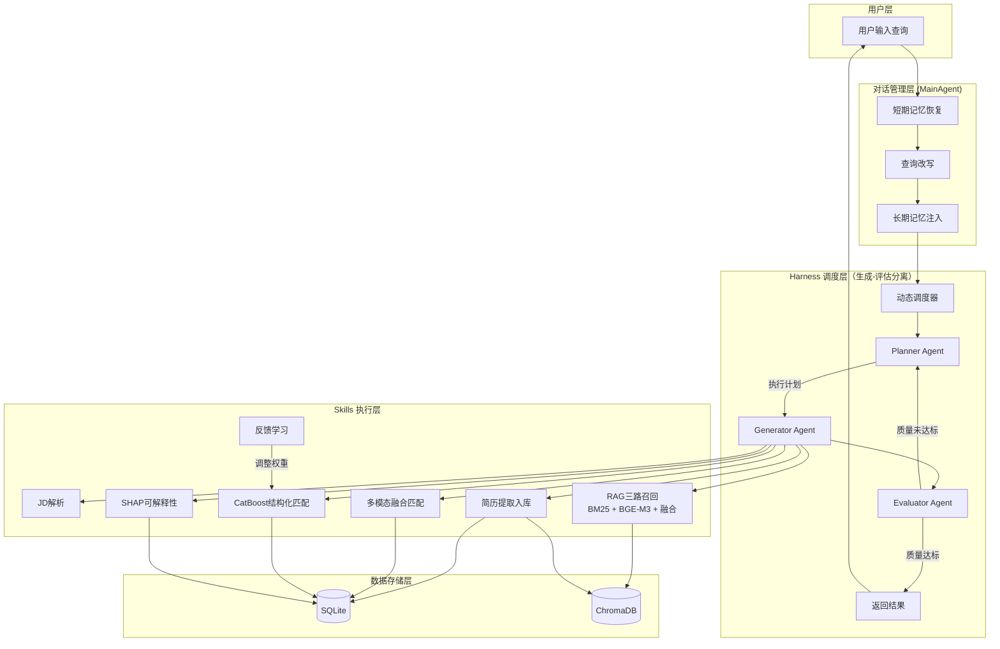

# How to Use - 使用指南

## 系统简介

本系统是基于Harness驱动的多模态分层融合智能招聘匹配系统，支持自然语言查询、多轮对话、多模态简历匹配和可解释性分析。

## 环境要求

- Python 3.11+
- SQLite 3.45.0+
- 磁盘空间 ≥4GB（模型~2.2GB + 数据库~500MB）
- 8GB+ RAM（BGE-M3 模型 567M 参数，加载需约 3GB 内存）
- 无需 GPU（CPU 即可运行，首次建库约32分钟）

## 安装步骤

### 1. 克隆项目

```bash
git clone https://github.com/PengYi510/AI_Recruitment_Assistant.git
cd AI_Recruitment_Assistant
```

### 2. 创建虚拟环境

```bash
python -m venv venv
# Windows
venv\Scripts\activate
# Linux/Mac
source venv/bin/activate
```

### 3. 安装依赖

```bash
pip install -r requirements.txt
```

### 3.5 下载 BGE-M3 嵌入模型（首次必须执行）

本项目使用北京智源研究院开源的 BAAI/bge-m3 模型（567M参数，1024维，~2.2GB）。模型文件太大不包含在 Git 仓库中，需自行下载到 `models/bge-m3/` 目录。

```bash
# 方式一：huggingface-cli（推荐）
pip install huggingface_hub
huggingface-cli download BAAI/bge-m3 --local-dir models/bge-m3

# 方式二：git clone
git lfs install
git clone https://huggingface.co/BAAI/bge-m3 models/bge-m3
```

下载完成后确认 `models/bge-m3/model.safetensors` 文件存在即可。

> 注：若未下载 BGE-M3 文本模型或 BLIP 视觉模型，系统会对对应模态自动降级为 hash-based 确定性向量（仅用于架构验证，不具备真实语义能力）。默认配置下图像模态使用真实 BLIP-base 视觉编码器。

### 4. 初始化数据库（首次运行必须执行）

将 1000 条合成简历数据导入 SQLite 数据库和 ChromaDB 向量库：

```bash
python -m data.scripts.init_database
```

此脚本为幂等操作，重复运行会先清空再重新导入。运行完成后应看到 `SQLite 候选人数: 1000` 和 `ChromaDB 向量数: 1000` 的验证输出。

### 5. 环境变量配置

创建`.env`文件或设置环境变量：

```bash
export LLM_API_KEY="your-longcat-api-key"
export LLM_BASE_URL="https://api.openai.com/v1"
export LLM_MODEL="ep-20250305164825-hxfln"
```

### 5.5 Redis 配置（可选）

系统使用 Redis 作为会话状态存储（SessionStore），支持跨进程、跨重启的会话上下文保持。

**如果本地有 Redis 服务**：无需额外配置，系统默认连接 `localhost:6379`。

**如果使用远程 Redis**：

```bash
export REDIS_HOST="your-redis-host"
export REDIS_PORT="6379"
export REDIS_DB="0"
export REDIS_PASSWORD="your-password"  # 无密码则不设置
```

**如果没有 Redis**：系统会自动回退到内存存储（InMemorySessionStore），所有功能正常工作，仅服务重启后会话上下文会丢失。启动时会在日志中显示当前使用的存储后端：

```
[INFO] Redis 连接成功，使用 RedisSessionStore
# 或
[WARNING] Redis 不可用，回退到 InMemorySessionStore
```

## 使用方式

> **重要提示**：首次启动前必须先运行 `python -m data.scripts.init_database` 初始化数据库，否则系统无法返回候选人结果。

### 方式一：一键启停（推荐）

**Windows（PowerShell）：**

```powershell
# 启动前端、后端、管理面板（后台运行）
.\service.ps1 start

# 查看运行状态
.\service.ps1 status

# 查看实时日志（Ctrl+C 退出）
.\service.ps1 logs

# 停止所有服务
.\service.ps1 stop

# 重启
.\service.ps1 restart
```

> 若首次运行 PowerShell 脚本被策略拦截，可在当前会话放开：`Set-ExecutionPolicy -Scope Process -ExecutionPolicy Bypass`。
> 脚本会按 `venv313 → venv → C:\Python314` 顺序自动选择 Python 解释器。

**Linux / macOS（Bash）：**

```bash
# 启动前后端及管理面板服务（后台运行）
bash service.sh start

# 查看运行状态
bash service.sh status

# 查看实时日志
bash service.sh logs

# 停止所有服务
bash service.sh stop

# 重启
bash service.sh restart
```

启动后打开浏览器访问：

- 前端页面：**http://localhost:9033**
- 开发者管理面板：**http://localhost:9035**（实际端口见启动日志输出）
- 管理面板账号：admin / admin（超级管理员）

### 方式二：手动分别启动

```bash
# 终端1：启动后端API服务（端口8003）
python http_server.py

# 终端2：启动前端Web服务（端口9033）
python frontend_server.py

# 终端3：启动管理面板（端口9035+，自动递增）
python admin_server.py
```

打开浏览器访问 `http://localhost:9033`

### 方式三：API调用

#### 多轮对话（后端API）

```python
import requests

BACKEND = "http://localhost:8003"

# 第一轮：搜索候选人
response = requests.post(f"{BACKEND}/chat", json={
    "session_id": "test-001",
    "message_id": "msg-001",
    "emp_id": "12345",
    "query": "帮我找Java高级工程师"
})
result = response.json()
print(result["answer"])

# 第二轮：引用上一轮结果（支持指代消解）
response = requests.post(f"{BACKEND}/chat", json={
    "session_id": "test-001",
    "message_id": "msg-002",
    "emp_id": "12345",
    "query": "看看第一个候选人的详细信息"
})
result = response.json()
print(result["answer"])
```

#### 智能匹配（Harness驱动）

```python
import asyncio
from backend.api.routes import handle_matching_request

async def main():
    result = await handle_matching_request(
        "需要一位有5年经验的Python高级工程师，熟悉分布式系统"
    )
    print(f"匹配到 {len(result.get('matched_candidates', []))} 位候选人")

asyncio.run(main())
```

#### SHAP可解释性分析

```python
from backend.api.routes import handle_explain
import asyncio

async def main():
    explanation = await handle_explain(
        candidate_id=1,
        match_score=0.85,
        level="all"
    )
    print(explanation['nlp_explanation']['explanation'])

asyncio.run(main())
```

#### 提交反馈

```python
from backend.api.routes import handle_feedback
import asyncio

async def main():
    result = await handle_feedback(history_id=1, feedback=1)  # 1=满意, 0=不满意
    print(result)

asyncio.run(main())
```

## 真实简历入库示例（杨方）

以下演示如何将一份真实简历（杨方）通过 `ResumeExtractionSkill` 入库到 SQLite 和 ChromaDB：

```python
import asyncio
from backend.skills.resume_extraction_skill import ResumeExtractionSkill

# 杨方的简历原文（示例片段）
resume_text = """
杨方
男 | 25岁 | 硕士 | 北京
电话：13800138000 | 邮箱：yangfang@example.com

【教育经历】
2021.09-2024.06  北京大学（985/双一流）  计算机科学与技术  硕士
2017.09-2021.06  武汉大学（985/双一流）  软件工程  本科  GPA: 3.8/4.0

【专业技能】
Python, PyTorch, TensorFlow, NLP, 大模型微调, RAG, LangChain

【工作/实习经历】
2023.06-2023.12  美团  算法工程师（实习）
负责搜索推荐场景的 NLP 模型优化，基于 BERT 改进 query 理解模块，CTR 提升 2.3%

【项目经历】
2023.03-2023.06  基于 RAG 的智能问答系统（核心开发）
使用 LangChain + ChromaDB 构建企业知识库问答，支持多轮对话和上下文记忆

【其他信息】
民族：汉族 | 政治面貌：中共党员 | 兴趣爱好：篮球、阅读、开源贡献
目标岗位：NLP算法工程师 | 语言能力：英语CET-6 580分
自我评价：热爱技术，有较强的工程落地能力和团队协作精神
"""

async def ingest_yangfang():
    skill = ResumeExtractionSkill()
    
    # 方式一：直接调用 extract_and_index（同时写入 SQLite + ChromaDB）
    result = await skill.extract_and_index(resume_text)
    print(f"入库成功！候选人ID: {result['candidate_id']}")
    print(f"提取字段: {list(result['extracted_data'].keys())}")
    print(f"动态属性: {result['extracted_data'].get('extra_attributes', {})}")
    
    # 方式二：仅提取结构化数据（不入库）
    extracted = await skill.execute({"resume_text": resume_text})
    print(f"提取结果: {extracted}")

asyncio.run(ingest_yangfang())
```

运行后，杨方的简历数据将被：
1. **结构化存储到 SQLite**：`candidates` 表（基础字段）+ `candidate_extra_attributes` 表（GPA、民族、爱好等动态属性）+ `resume_raw_text` 字段（原始文本）
2. **向量化存储到 ChromaDB**：`document` 字段存储原始文本用于展示，`embedding` 为 BGE-M3 1024维语义向量用于检索，`metadata` 包含结构化字段和 `extra_` 前缀的动态属性用于过滤

入库完成后，即可通过自然语言查询检索到该候选人，例如："帮我找一个北大硕士、熟悉NLP和RAG的算法工程师"。

## 端口与服务说明

| 服务 | 文件 | 端口 | 说明 |
|------|------|------|------|
| 后端 API | `http_server.py` | 8003 | FastAPI + Uvicorn，处理对话与Harness调度 |
| 前端 Web | `frontend_server.py` | 9033 | Flask，提供Web界面和SSE流式推送 |
| 管理面板 | `admin_server.py` | 9035+ | FastAPI + Uvicorn，简历管理/LLM配置/用户管理 |

前端通过环境变量 `BACKEND_URL`（默认 `http://localhost:8003`）调用后端接口，两个服务需同时运行。系统无需登录，打开即可使用。管理面板端口从 9035 开始，如被占用自动递增。

## 简历自动入库系统

### 简历文件存放

将简历文件放入 `resume_data/` 目录即可，系统会自动按周创建子文件夹：

```
resume_data/
├── 20260609——20260615/    # 本周文件夹（自动创建）
│   ├── 张三20260610_14_30_00_12345_resume_v1.pdf
│   ├── 李四20260611_09_00_00_67890_cv_final.docx
│   └── 王五20260612_16_45_30_11111_简历.md
└── 20260616——20260622/    # 下周文件夹（到时自动创建）
```

### 文件命名规范

推荐格式：`用户名年月日_小时_分钟_秒_用户id_xxx_xxxx.扩展名`

示例：`张三20260614_10_30_00_12345_resume_v1.pdf`

支持的文件格式：

- `.pdf` — PDF 文档（使用 pdfplumber 提取文本）
- `.docx` — Word 文档（使用 python-docx 提取文本）
- `.md` — Markdown 文件（直接读取）
- `.txt` — 纯文本文件（直接读取）
- `.pptx` — PPT 演示文稿（使用 python-pptx 提取文本）

### 自动扫描机制

后台线程在以下时间点自动扫描：每天 **0:00, 4:00, 8:00, 12:00, 16:00, 20:00**

扫描逻辑：
1. 递归扫描 `resume_data/` 下所有子文件夹
2. 跳过已处理和隐藏文件
3. 对每个新文件执行：文本提取 → LLM 结构化抽取 → 写入 SQLite + ChromaDB
4. 记录处理状态到 `data/scanner_state.json`

如果系统离线后重启，会自动检测上次扫描时间，超过4小时未扫描则立即补扫。

### 手动入库

通过管理面板（http://localhost:9035）的「待入库简历」页面，可以：
- 查看所有待处理文件
- 多选文件手动触发入库
- 点击「立即扫描」按钮手动触发全量扫描

### 开发者管理面板

访问地址：`http://localhost:9035`（实际端口见 `bash service.sh start` 输出）

**登录账号**：
- 超级管理员：`admin` / `admin`（完整 CRUD 权限）
- 普通管理员：通过注册页面创建（只读权限）

**功能模块**：
- 已入库简历：分页浏览、搜索、查看详情、删除（超级管理员）
- 待入库简历：文件列表、多选入库、立即扫描、扫描状态统计
- LLM 配置：查看/修改 API Key、Base URL、Model（运行时生效）
- 系统日志：查看后端/前端/管理面板日志
- 用户管理：查看用户列表、删除普通管理员（超级管理员）

## 系统 Agent 编排流程图



## 核心功能说明

### 1. 多轮对话记忆

系统支持上下文感知的连续对话：
- **短期记忆**：滑动窗口保留最近10轮结构化记忆（实体、意图、结果摘要）
- **查询改写**：自动将"第一个候选人"、"还有呢"等指代/省略表达还原为完整查询
- **会话持久化**：SQLite存储对话历史，服务重启后可恢复

### 2. Harness驱动流程

系统采用"生成-评估"分离架构：
1. Planner分析查询，制定执行计划
2. Generator调用Skills执行匹配
3. Evaluator评估结果质量
4. 未达标则反馈调整，重新迭代

### 3. RAG三路召回

- BM25稀疏检索：关键词匹配打分
- BGE-M3 稠密向量检索：语义相似度（ChromaDB，1024维，余弦距离）
- 加权融合：BM25×0.3 + Dense×0.7，融合前对分数做 min-max 归一化

### 4. 多模态匹配

支持三种模态的融合匹配：
- 文本特征：BGE-M3 模型提取 1024 维语义嵌入（567M参数，中英文多语言）
- 图像特征：真实 BLIP-base 视觉编码器对真实证书图像（512×384 PNG）推理得到 768 维特征（原设计为 BLIP-3-7B，因 transformers 5.x 与其官方远程代码不兼容而回退到同系 BLIP-base）
- 结构化特征：梯度提升决策树提取 12 维特征（学历、经验等；首选 CatBoost，无 wheel 时回退为 scikit-learn GradientBoosting 真实训练）

### 5. SHAP可解释性

提供四层解释：
- 全局层：所有特征的重要性排序
- 个体层：单个候选人的SHAP贡献
- 交互层：特征间的协同效应
- NLP层：自然语言总结

### 6. 反馈学习（系统级长期记忆）

- 用户对匹配结果给出满意/不满意反馈
- 系统通过指数移动平均动态调整CatBoost特征权重
- 基于滑动窗口自适应调整复杂度分类阈值
- 反馈持久化到SQLite，跨会话、跨重启生效

## 配置说明

通过环境变量可覆盖默认配置：

| 环境变量 | 默认值 | 说明 |
|----------|--------|------|
| `BACKEND_URL` | `http://localhost:8003` | 后端API地址（前端调用） |
| `SECRET_KEY` | 内置默认值 | Flask会话密钥 |
| `DOWNLOAD_WHITELIST` | `admin,pengyi14` | 有下载权限的MIS（逗号分隔） |
| `TAG_WHITELIST` | `admin,pengyi14` | 有标签权限的MIS（逗号分隔） |
| `LLM_API_KEY` | - | LLM API密钥 |
| `LLM_BASE_URL` | 内置默认值 | LLM服务地址 |
| `REDIS_HOST` | `localhost` | Redis服务器地址 |
| `REDIS_PORT` | `6379` | Redis端口号 |
| `REDIS_DB` | `0` | Redis数据库编号 |
| `REDIS_PASSWORD` | (空) | Redis密码（可选） |

## 运行测试

```bash
# 运行所有测试
pytest tests/ -v

# 带覆盖率
pytest tests/ --cov=backend --cov-report=term-missing --cov-report=html

# 运行特定测试
pytest tests/test_database.py -v
pytest tests/test_multimodal.py -v
pytest tests/test_harness.py -v
```

## 实验复现

```bash
# 一键运行全部实验（对比 + 消融）
python -m experiments.run_experiments

# 仅运行对比实验（Section 6.3）
python -m experiments.run_comparison

# 仅运行消融实验（Section 6.4）
python -m experiments.run_ablation

# 自定义参数运行
python -m experiments.run_comparison --candidates 100 --jds 20 --top_k 10 --seed 42
```

实验结果保存在 `data/synthetic/experiment_results.json`。

## 常见问题

**Q: 启动报 `ModuleNotFoundError: No module named 'configs'`？**
A: 确认你在 `hr_agent_mt/` 目录下运行，且 `configs.py` 文件存在。

**Q: ChromaDB初始化失败？**
A: 确保已安装 `chromadb==0.5.11`，系统会自动降级到内存存储。

**Q: LLM API超时？**
A: 检查 `LLM_BASE_URL` 配置，确保网络连通性。系统有重试机制。

**Q: 端口被占用？**
A: 先运行 `bash service.sh stop` 清理残余进程，或手动 `lsof -ti :8003 | xargs kill -9`。

**Q: 多轮对话不生效（每轮都像新对话）？**
A: 确保同一会话的所有请求使用相同的 `session_id`，后端通过 SessionStore（Redis 或内存回退）维护对话上下文。

**Q: 启动时显示"Redis 不可用，回退到 InMemorySessionStore"？**
A: 这是正常行为。如果本地未安装 Redis 或 Redis 未启动，系统会自动回退到内存存储。若需使用 Redis：安装并启动 Redis 服务（`redis-server`），然后重启应用即可。

**Q: 查询返回“未找到候选人”？**
A: 确保已运行 `python -m data.scripts.init_database` 初始化数据库。该脚本会将 1000 条候选人数据导入 SQLite 和 ChromaDB，没有数据则无法返回匹配结果。

## 技术支持

如有问题请联系项目维护者。
