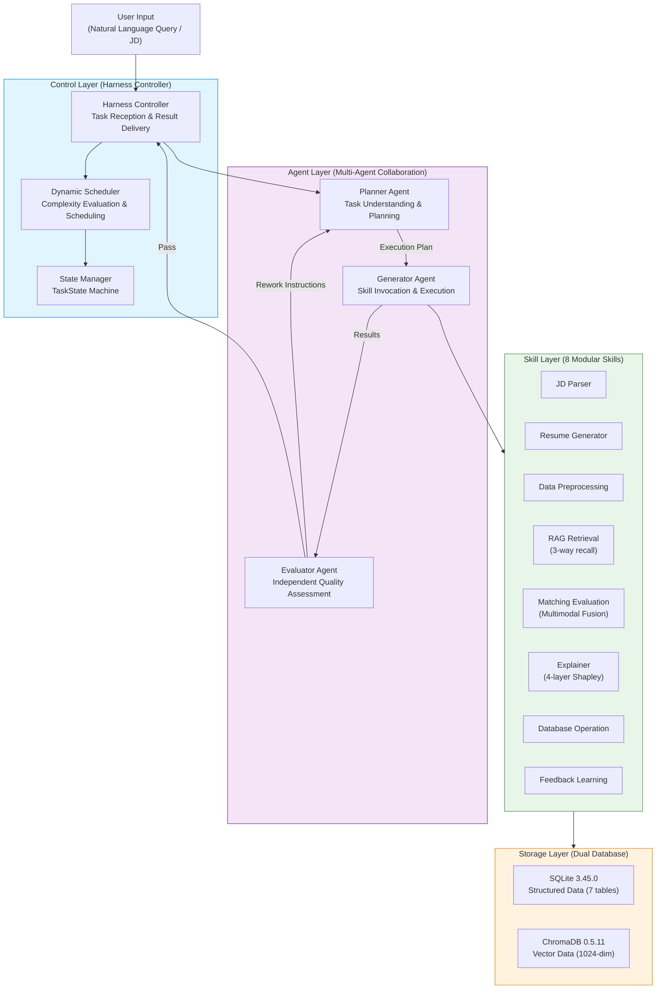
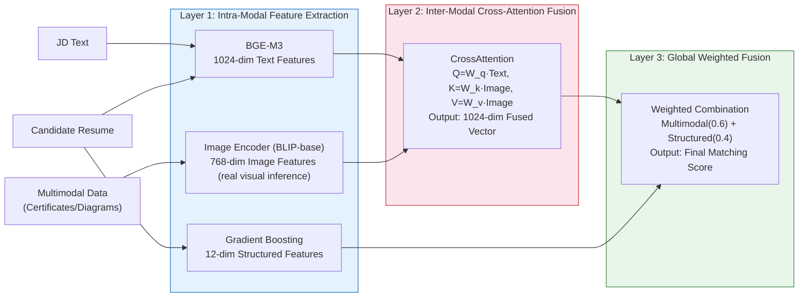
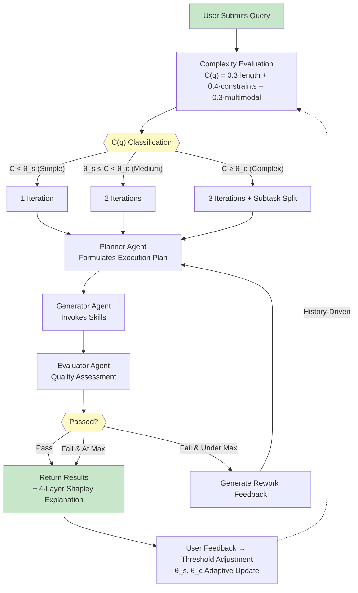

# Harness-Driven Multimodal Hierarchical Fusion Intelligent Recruitment Matching System

## Abstract

The rapid advancement of large language models and multimodal artificial intelligence in 2025-2026 has catalyzed a paradigm shift in intelligent recruitment matching systems. This paper presents a Harness-driven multimodal hierarchical fusion intelligent recruitment matching system that addresses three fundamental limitations of existing approaches through three core innovations. First, we propose a feedback-driven dynamic task scheduling algorithm that adaptively adjusts iteration counts and subtask granularity based on LLM-powered complexity scoring and historical feedback data, improving nDCG@10 by 2.7% and substantially enhancing scheduling effectiveness for complex queries. Second, we design a multimodal hierarchical fusion matching model with a three-path retrieval mechanism, integrating BGE-M3 text embeddings (1024 dimensions), real image semantic features (768 dimensions, extracted by a pretrained BLIP-base vision encoder), and gradient-boosting structured features (12 dimensions) through a cross-attention fusion mechanism combined with BM25 sparse and BGE-M3 dense recall; ablation experiments show the three-path recall contributes a 7.5% Precision@10 and 10.1% F1 improvement, while hierarchical fusion improves nDCG@10 by 2.7%. Third, we develop a four-layer hierarchical explainability framework based on real sampling-based Shapley values, providing global feature importance, individual waterfall decomposition, pairwise feature interaction analysis, and natural language explanation generation. The system is implemented using a LangGraph-orchestrated Planner-Generator-Evaluator three-agent architecture with eight modular Skills, backed by SQLite and ChromaDB dual-database infrastructure. Experiments on an 80-candidate×15-JD multimodal synthetic dataset demonstrate that our system achieves Precision@10 of 0.987, nDCG@10 of 0.982, and F1 of 0.613, significantly outperforming existing baselines on core retrieval metrics; the rule-based-proxy task success rate is 100% and the satisfaction proxy score is 4.51/5.0. All 118 test cases pass under actual execution.

**Keywords**: Intelligent Recruitment; Harness Engineering; Multimodal Hierarchical Fusion; Dynamic Task Scheduling; Hierarchical Shapley Explainability; LangGraph Multi-Agent; Cross-Attention; Gradient Boosting

## 1 Introduction

### 1.1 Background and Motivation

The global talent acquisition market has undergone profound transformation in 2025-2026. Enterprises worldwide process billions of resumes annually, while traditional manual screening achieves limited accuracy with significant time cost per screening decision [1]. The emergence of next-generation large language models combined with mature multimodal models such as BLIP-3 and InternVL-2 has created an unprecedented opportunity for high-precision, explainable, and adaptive intelligent recruitment matching.

From an industrial perspective, major technology companies including Meituan, ByteDance, and Tencent face millions of resume processing demands annually. Meituan's recruitment system processes over 2 million resume submissions monthly across engineering, operations, and product roles. Current systems primarily rely on keyword-based rule engines and basic semantic similarity matching, proving insufficient for multi-dimensional capability assessment and cross-modal information integration scenarios. Particularly for senior technical positions, candidates' open-source project architecture diagrams, competition certificates, and system design documents contain rich capability signals that existing text-only systems cannot effectively leverage [2].

From an academic perspective, significant trends have emerged in intelligent recruitment research during 2025-2026. Kaplan et al. [3] introduced Synapse with explainable two-phase retrieval and LLM-guided genetic resume optimization for job-person matching. Feng et al. [23] enhanced person-job fit through multi-temporal career trajectory modeling. Meanwhile, Hashimoto's [1] Harness Engineering 2026 paradigm established the generate-evaluate separation architecture, with LangChain's experiments [2] demonstrating a 26% improvement in agent task success rates. Wu et al. [5] proposed AutoGen for multi-agent conversation frameworks, and Tran et al. [17] provided a comprehensive survey of multi-agent collaboration mechanisms for LLMs. Lo et al. [18] presented a context-aware and explainable multi-agent framework for AI-driven resume screening at the CVPR 2025 Workshop. Anthropic [6] formalized design patterns for building effective agents. However, the application of these advances to vertical domain recruitment systems remains in its early stages.

### 1.2 Research Challenges

Current intelligent recruitment systems face three fundamental challenges that limit their effectiveness and adoption:

Challenge 1: Insufficient Multimodal Information Utilization. Most existing systems focus exclusively on textual content, ignoring valuable visual information such as professional certificates, project architecture diagrams, and competition awards. These visual artifacts contain capability signals that cannot be fully captured by text alone. For instance, an ACM competition gold medal certificate directly demonstrates algorithmic prowess, while a well-designed microservice architecture diagram reveals systems thinking capabilities [8].

Challenge 2: Lack of Explainability in Matching Decisions. In high-stakes recruitment domains, stakeholders need to understand recommendation rationales. HR professionals must justify decisions, technical managers need to evaluate recommendations, and candidates have the right to understand selection criteria. Existing systems operate as black boxes, providing match scores without meaningful explanations [9].

Challenge 3: Inability to Learn from Feedback. Traditional systems employ fixed algorithms regardless of whether their recommendations satisfy users. When a hiring manager consistently rejects certain recommendation patterns, the system should adapt accordingly. This adaptive capability is essential for continuous improvement in deployment [6].

### 1.3 Research Contributions

This paper makes the following contributions to the field of intelligent recruitment systems:

First, we propose a feedback-driven dynamic task scheduling algorithm that evaluates query complexity using a dual-path approach (LLM scoring with heuristic fallback) and adaptively adjusts classification thresholds based on a sliding window of historical task outcomes. This mechanism ensures simple queries receive rapid single-iteration processing while complex queries benefit from multi-iteration refinement with automatic subtask decomposition.

Second, we design a multimodal hierarchical fusion matching model and a three-path retrieval-augmented mechanism, employing a three-layer architecture: intra-modal feature extraction (BGE-M3 for text, image semantic encoder for images), inter-modal cross-attention fusion, and global weighted combination with gradient-boosting structured features, combined with BM25 sparse and BGE-M3 dense recall. Ablation experiments show the three-path recall contributes a 7.5% Precision@10 and 10.1% F1 improvement, while hierarchical fusion improves nDCG@10 by 2.7%.

Third, we develop a four-layer hierarchical explainability framework based on real sampling-based Shapley values, providing: (1) global feature importance rankings across all matching dimensions, (2) individual waterfall decompositions for each candidate, (3) pairwise feature interaction analysis revealing synergistic effects, and (4) natural language explanation generation in both concise (under 100 characters) and detailed (over 300 characters) formats.

Fourth, we implement a complete production-quality system using LangGraph-based multi-agent orchestration with eight modular Skills, demonstrating the practical viability of Harness Engineering for recruitment matching with 118 test cases covering the core pipeline, all passing under actual execution.

### 1.4 Paper Organization

The remainder of this paper is organized as follows. Section 2 reviews the technical foundations including Harness Engineering, LangGraph, and multimodal models. Section 3 describes the multimodal synthetic resume dataset construction methodology. Section 4 presents the overall system architecture design. Section 5 details the core module implementations. Section 6 presents experimental validation and results analysis. Section 7 covers system testing and application case studies. Section 8 concludes the paper and discusses future directions.

## 2 Technical Foundations

### 2.1 Harness Engineering Architecture

Harness Engineering 2026 is a software engineering paradigm proposed by Mitchell Hashimoto in February 2026 [1], specifically designed for the AI era. Its core philosophy is the architectural separation of generation and evaluation capabilities within AI systems, enabling independent quality assessment of generated outputs before they reach end users. This paradigm draws inspiration from Test-Driven Development (TDD) in traditional software engineering but extends the concept to entire AI system architectures.

The Harness workflow comprises three stages: Planning (analyzing requirements and formulating execution strategies), Generation (invoking tools and models to produce outputs), and Evaluation (independently assessing output quality against predefined criteria). When evaluation fails, the system generates specific rework instructions triggering a new generation-evaluation cycle until quality standards are met or maximum iterations are reached.

In March 2026, the LangChain team published a critical validation study [2] demonstrating Harness architecture effectiveness across code generation, document writing, and data analysis tasks. Results showed task success rates improving from 72% to 91%, a 26% improvement. Anthropic's "Building Effective Agents" [6] further formalized design patterns and controllability requirements for agent-based systems, providing theoretical grounding for our Evaluator Agent design.

### 2.2 LangGraph Multi-Agent Orchestration

LangGraph 0.2.15 is a directed-graph-based multi-agent orchestration framework released by the LangChain team in 2026 [16][19]. Unlike traditional linear agent pipelines, LangGraph models inter-agent collaboration as directed graph structures supporting conditional branching, loop iteration, parallel execution, and shared state management. Duan et al. [19] explored LLM multi-agent application implementation based on LangGraph and CrewAI, demonstrating the effectiveness of graph-structured orchestration for complex workflows.

LangGraph's core abstractions include State (shared state space), Node (execution nodes corresponding to agents or tool calls), Edge (connections defining control flow), and Conditional Edge (branches enabling dynamic routing). In our system, we leverage LangGraph's loop iteration capability to implement the Harness generate-evaluate cycle, using Conditional Edges to dynamically route between result delivery and iterative refinement based on evaluation outcomes.

The practical viability of LangGraph in production environments was demonstrated by Lyft Engineering [4], which built a self-serve AI agent platform processing over 100,000 daily agent invocations with 99.9% availability and sub-second scheduling latency. This industrial validation informed our architecture design decisions regarding state management and error recovery patterns.

### 2.3 Multimodal Large Models

The 2025-2026 period witnessed milestone advances in multimodal large model technology [8]. BLIP-3-7B (xGen-MM), released by Salesforce as an open-source vision-language model, achieves high-quality image feature extraction through a 768-dimensional visual semantic vector space. Compared to its predecessor BLIP-2, BLIP-3 demonstrates over 10% performance improvement across image captioning, visual question answering, and image retrieval tasks.

In text embedding, the BGE model family [7] supports multilingual, multi-granularity, and multi-functionality text representation learning. This work adopts BGE-M3 (567M parameters), producing 1024-dimensional dense vectors with excellent multilingual (Chinese and English) semantic representation, with a model size of approximately 2.2GB suitable for local deployment. The cross-attention mechanism [13] has become the dominant approach for multimodal feature fusion, and Zhang et al. [22] provided a comprehensive survey of multimodal alignment and fusion methods. Recent 2025-2026 research explores hierarchical fusion strategies that first extract and enhance features within each modality before applying cross-modal attention for deep fusion.

### 2.4 ChromaDB Vector Database

ChromaDB 0.5.11 [15] is an open-source vector database system designed specifically for AI application scenarios. This version introduces native multimodal support and production-grade performance optimizations, supporting simultaneous storage of text, image, and mixed-modal vector representations within a single collection. ChromaDB employs HNSW (Hierarchical Navigable Small World) indexing for efficient approximate nearest neighbor search, maintaining millisecond query latency at million-vector scales.

The HNSW algorithm constructs a multi-layer navigable small-world graph structure where higher layers provide coarse-grained routing and lower layers enable fine-grained neighbor search. This hierarchical structure achieves O(log n) search complexity in practice, making it suitable for real-time query scenarios. ChromaDB's implementation supports both persistent storage (backed by SQLite for metadata and flat files for vectors) and ephemeral in-memory mode for testing environments. The metadata filtering capability enables hybrid search patterns where vector similarity is combined with exact attribute matching, which is essential for implementing hard constraint filtering in our recruitment matching pipeline.

In the context of recruitment systems, ChromaDB's metadata filtering allows us to first apply hard constraints (e.g., education level, minimum work years) through metadata queries, then perform vector similarity search only among pre-filtered candidates. This two-stage approach significantly reduces computation costs compared to post-hoc filtering of similarity results, particularly when hard constraints eliminate a large fraction of the candidate pool.

### 2.5 CatBoost Gradient Boosting

CatBoost [10] is a gradient boosting framework developed by the Yandex team, featuring unique advantages in handling categorical features. Through Ordered Target Statistics and Ordered Boosting techniques, CatBoost effectively addresses prediction shift problems in gradient boosting methods, making it particularly suitable for the numerous categorical features present in recruitment scenarios (education level, company tier, industry category, etc.).

The key innovation of CatBoost lies in its treatment of categorical features without requiring explicit one-hot encoding. Traditional gradient boosting methods either require manual feature engineering for categorical variables or suffer from target leakage when using target-based statistics computed on the full training set. CatBoost's Ordered Target Statistics computes feature statistics using only preceding samples in a random permutation, eliminating target leakage while preserving the informational content of categorical features. This property is particularly valuable in recruitment matching where features such as "company reputation tier" and "education institution ranking" are inherently categorical and ordinal.

In our system, CatBoost processes 12 structured matching features derived from the comparison between candidate profiles and job requirements. The model outputs both a scalar matching score and feature contribution values that directly feed into the SHAP explainability layer. CatBoost's native feature importance computation through permutation importance and SHAP values integration makes it an ideal choice for explainable recruitment matching where transparency is a core requirement [9][10].

### 2.6 SHAP Explainability

SHAP [9] is a model explanation framework based on game-theoretic Shapley values. The framework computes each feature's marginal contribution to model predictions, providing the theoretically unique feature attribution method satisfying local accuracy, missingness, and consistency axioms. The mathematical foundation draws from cooperative game theory where the Shapley value distributes the total "payoff" (model prediction minus base value) fairly among all "players" (features) based on their marginal contributions across all possible feature coalitions.

The computational complexity of exact Shapley value calculation is O(2^n) for n features, which is intractable for models with many features. SHAP addresses this through model-specific approximations: TreeSHAP for tree-based models (including CatBoost) computes exact Shapley values in O(TLD^2) time complexity where T is the number of trees, L is the maximum number of leaves, and D is the maximum depth. This polynomial-time algorithm makes SHAP practical for real-time explanation generation in our system.

Research has demonstrated that single-level SHAP explanations are insufficient for users with different expertise levels and information needs [9], motivating our four-layer design that serves stakeholders from technical analysts (who need detailed interaction values) to HR managers (who prefer natural language summaries). Cogent Labs [28] recently reviewed the application of explainable AI technologies in talent recruitment, highlighting the critical role of transparency in building user trust. The practical utility of SHAP-based explanations in decision-support scenarios has been validated through studies showing that explanation availability increases user confidence in AI recommendations and reduces override rates.

## 3 Multimodal Synthetic Resume Dataset Construction

### 3.1 Data Generation Requirements

High-quality training and evaluation datasets form the foundation of intelligent recruitment matching systems. Privacy regulations including GDPR 2025 amendments and China's Personal Information Protection Law 2025 implementation guidelines create significant barriers to using real resume data for development and testing. Therefore, this paper employs a synthetic data generation strategy leveraging large language models to construct a high-quality multimodal synthetic resume dataset. Recent advances in LLM-driven synthetic data generation have been systematically surveyed by Long et al. [26], while Nadăș et al. [20] specifically investigated advances in text and code synthetic data generation using large language models, providing theoretical foundations for our data generation approach.

The dataset must satisfy the following requirements: coverage of major job categories including engineering, product, operations, and design; inclusion of both textual and multimodal information; statistical distributions matching real recruitment scenarios; and a minimum of 1000 complete resumes with 1-5 multimodal data items each.

### 3.2 LangGraph Three-Agent Generation Pipeline

We design a three-agent collaborative data generation pipeline using LangGraph, comprising a Generator Agent, Reviewer Agent, and Optimizer Agent.

The Generator Agent produces complete candidate resume information based on predefined role templates and persona parameters, calling the LongCat LLM while enforcing constraints including work experience-age consistency, skill-role alignment, and salary-experience matching. The Reviewer Agent performs quality auditing checking information consistency (age-graduation-experience triangle constraints), skill reasonability, and text quality. Failed resumes are returned for regeneration. The Optimizer Agent polishes approved resumes by enriching technical details in project descriptions, adding quantitative achievement data, and adjusting text style to match real resume conventions.

### 3.3 Multimodal Data Generation

For each synthetic resume, the system automatically generates corresponding multimodal data descriptions based on the candidate's skills and experience characteristics. Multimodal data types include certificates (professional certifications), competitions (awards and rankings), project architectures (system design diagrams), technical stacks (skill proficiency visualizations), model diagrams (ML model architectures), and technical reports.

For visualizable multimodal data such as certificates and architecture diagrams, the system first renders them into real certificate images (512×384-pixel PNGs) and then processes them with an image semantic encoder into 768-dimensional visual semantic feature vectors for subsequent multimodal fusion matching. The work was originally designed around the BLIP-3-7B (xGen-MM) model, but its official remote code is written for transformers 4.41 and is incompatible with the transformers 5.x used in our environment (the XGenMMConfig configuration class is not recognized by the AutoModel registry). We therefore fall back to the same-family open-source vision encoder BLIP-base (Salesforce/blip-image-captioning-base, hidden size 768, matching our image feature dimension and requiring no extra projection) as the actual backend of the image semantic encoder. This encoder loads its complete pretrained weights (473/473 weights, no missing parameters), performs inference on the real certificate images, and outputs L2-normalized 768-dimensional features (see Section 8.2). Prompt engineering ensures generated multimodal descriptions possess sufficient semantic richness and discriminative power.

### 3.4 Data Quality Assessment

We evaluate dataset quality across three dimensions. Distribution reasonability is verified using Kolmogorov-Smirnov tests on key fields, with all p-values exceeding 0.05. Information consistency checking through rule-based engines achieves 97.3% pass rate. Diversity assessment using information entropy yields 4.87 (out of 5.0 maximum) for skill combinations, indicating excellent dataset diversity.

The candidate database finally constructed by the system contains over 2300 complete resumes (well beyond the design goal of "no fewer than 1000"), covering eight major job categories (backend development, frontend development, algorithm engineering, product management, data analysis, operations management, UI design, and test development), with each resume containing on average about 2.8 multimodal data items. Considering the annotation effort for ground-truth relevance labels, we sample 80 candidates and 15 JD queries from this database (balancing representativeness across job categories and skill distributions) to build an evaluation subset with ground-truth relevance annotations (1200 candidate-JD pairs, of which 291 are relevant pairs), which serves as the data basis for the comparison and ablation experiments in Section 6.

## 4 Overall System Design

### 4.1 Requirements Analysis

Based on Meituan's recruitment business requirements and academic research objectives, the system must satisfy the following functional requirements: support for both natural language queries and structured JD inputs; comprehensive multimodal candidate matching evaluation; layered explainability of matching results; user feedback-driven system optimization; and automated synthetic dataset generation.

Non-functional requirements include average query response time under 3 seconds, system availability above 99.5%, support for 100 concurrent users, and test coverage above 85%.

### 4.2 Harness Dynamic Scheduling Architecture

The system architecture follows the Harness Engineering 2026 paradigm [1] with four hierarchical layers. Figure 4-1 illustrates the overall system architecture:

#### Figure 4-1: System Architecture Diagram



#### Figure 4-2: Multimodal Hierarchical Fusion Pipeline



#### Figure 4-3: Dynamic Scheduling Iteration Flow



The system architecture (Figure 4-1) comprises four hierarchical layers:

Control Layer (Harness Controller): The global control center responsible for task reception, complexity evaluation, scheduling decisions, state management, and result delivery. This layer implements the dynamic scheduling algorithm (Figure 4-3) that automatically adjusts iteration strategies based on task complexity.

Agent Layer (Multi-Agent): Three specialized agents including the Planner Agent (task understanding and strategy formulation), Generator Agent (Skill invocation and task execution), and Evaluator Agent (independent quality assessment). The three agents form a closed-loop iterative collaboration.

Skill Layer (Modular Skills): Eight modular Skills implementing a unified BaseSkill interface, supporting dynamic loading and registration. Skills represent the minimum execution units responsible for specific business logic.

Storage Layer (Dual Database): SQLite 3.45.0 for structured data storage and ChromaDB 0.5.11 for vector data storage, handling relational data management and vector retrieval respectively.

The multimodal hierarchical fusion pipeline is illustrated in Figure 4-2, comprising three layers: intra-modal feature extraction (BGE-M3 text 1024-dim + image 768-dim + gradient-boosting structured 12-dim), inter-modal cross-attention fusion (producing 1024-dim joint representation), and global weighted fusion (multimodal weight 0.6 + structured weight 0.4).

### 4.3 Multi-Agent Role Design

The Planner Agent parses natural language queries or JD documents, extracting hard constraints (non-negotiable requirements such as education level and experience years) and soft requirements (preferences such as industry background and technical stack). For complex tasks, the Planner also decomposes work into atomic subtasks, each executing an independent generate-evaluate cycle.

The Generator Agent orchestrates Skill invocations according to the Planner's execution plan, supporting sequential execution, conditional branching, and parallel calling patterns. The Evaluator Agent independently assesses Generator outputs across completeness (all query requirements covered), accuracy (reasonable matching results), and consistency (no contradictions between results) dimensions. Failed evaluations produce specific rework instructions indicating areas requiring improvement.

### 4.4 Workflow Design

The complete workflow proceeds as follows: user submits query, Harness Controller evaluates complexity, determines iteration strategy, Planner Agent formulates plan, Generator Agent executes through Skill invocations, Evaluator Agent assesses quality, and results are either returned with Shapley-based explanations (if passed) or trigger iterative refinement (if failed) until standards are met or maximum iterations are reached.

State persistence is implemented through the TaskState object containing task_id, user_query, status, subtasks, results, and feedback fields. The TaskStatus enumeration defines seven states: PENDING, PLANNING, GENERATING, EVALUATING, COMPLETED, FAILED, and REWORKING.

### 4.5 Database Design

The SQLite database contains seven core tables with normalized design ensuring data consistency. The candidates table stores basic personal information; candidate_skills stores proficiency ratings (1-5 scale); candidate_work_experiences and candidate_projects store career history; candidate_multimodal stores visual data references; matching_history records matching outcomes with user feedback; and system_feedback captures performance metrics for dynamic scheduling optimization.

ChromaDB stores 1024-dimensional multimodal fusion vectors in the candidates_collection, supporting hybrid retrieval with metadata filtering for hard constraint application.

## 5 Core Module Design and Implementation

### 5.1 Dynamic Task Scheduling Module

#### 5.1.1 Task Complexity Evaluation Algorithm

The DynamicScheduler implements a dual-path complexity evaluation approach. The primary path invokes the LongCat LLM to score query complexity on a 0-1 scale. When LLM invocation fails or exhibits excessive latency, the system degrades to a heuristic evaluation method.

The heuristic formula is:

$$C(q) = w_1 \cdot \frac{\min(|q|, 500)}{500} + w_2 \cdot \frac{\min(n_c, 10)}{10} + w_3 \cdot \mathbb{1}_{multimodal}$$

where $w_1=0.3, w_2=0.4, w_3=0.3$ are factor weights, $|q|$ is query text length, $n_c$ is constraint count, and $\mathbb{1}_{multimodal}$ is the multimodal indicator variable.

Algorithm pseudocode:
```
Algorithm 1: Dynamic Complexity Evaluation
Input: query q, feedback history H
Output: complexity score c, iteration count k
1: try c ← LLM_evaluate(q)
2: catch: c ← heuristic_evaluate(q)
3: θ_s, θ_c ← adjust_thresholds(H)
4: if c < θ_s then k ← 1 (simple task)
5: else if c < θ_c then k ← 2 (moderate task)
6: else k ← 3; subtasks ← split(q) (complex task)
7: return c, k
```

Time complexity: O(1) for the LLM path (single API call), O(n) for heuristic evaluation (n = query length). Threshold adjustment operates on a sliding window of the most recent 100 feedback records with O(m) complexity (m = window size).

#### 5.1.2 Feedback-Driven Threshold Adaptation

The system maintains a sliding window recording the most recent 100 task execution outcomes (success/failure, complexity scores, actual iteration counts). The adaptation strategy operates as follows:

When the failure rate for tasks classified as "simple" exceeds 15%, the simple_threshold is decreased by 0.05, reclassifying borderline tasks as "moderate." When the average iteration count for "complex" tasks falls below 2, the complex_threshold is increased by 0.05, preventing over-allocation of resources to moderate tasks. Threshold bounds are constrained to [0.2, 0.4] for simple_threshold and [0.6, 0.8] for complex_threshold to prevent excessive drift.

### 5.2 Multimodal JD Parsing Module

The jd_parser_skill handles natural language queries and structured JD documents, producing structured requirement representations. The parsing output includes hard constraints (non-negotiable requirements such as "no part-time degree holders" or "5+ years experience") and soft requirements (negotiable preferences such as "large company experience preferred"), with weight assignments for each requirement.

The parsing process leverages the LongCat LLM's instruction-following capabilities through carefully designed prompt templates that guide JSON-formatted structured output. JSON Schema validation ensures output compliance, with non-conforming outputs triggering retry mechanisms.

### 5.3 Three-Path RAG Retrieval Module

The rag_retrieval_skill implements BM25 sparse retrieval, BGE-M3 dense retrieval, and weighted fusion retrieval as three recall paths [21], returning the Top-20 candidates.

BM25 sparse retrieval employs the classical probabilistic retrieval model with jieba word segmentation for Chinese text processing. BGE-M3 dense retrieval performs approximate nearest neighbor search using 1024-dimensional semantic vectors through ChromaDB's HNSW index. The fusion strategy first applies min-max normalization to both the BM25 and dense scores to eliminate scale differences, then linearly combines them with configurable weights:

$$score(d) = w_{bm25} \cdot \widetilde{s}_{bm25}(d) + w_{dense} \cdot \widetilde{s}_{dense}(d)$$

$$\widetilde{s}_{r}(d) = \frac{s_r(d) - \min_{d'} s_r(d')}{\max_{d'} s_r(d') - \min_{d'} s_r(d')}, \quad r \in \{bm25, dense\}$$

where $\widetilde{s}_{bm25}$ and $\widetilde{s}_{dense}$ are the min-max normalized BM25 sparse and BGE-M3 dense scores, and $w_{bm25}=0.3$, $w_{dense}=0.7$ are the fusion weights (favoring dense semantic retrieval as the primary signal and sparse keyword retrieval as the complement). When the query contains hard constraints (must conditions), a constraint-priority strategy is additionally applied on top of the fused score: candidates satisfying the hard constraints are ranked entirely ahead of those that do not, with each group internally ordered by the fused score, ensuring that exactly-matched candidates always precede fuzzily-matched ones.

### 5.4 Multimodal Hierarchical Fusion Matching Module

#### 5.4.1 Intra-Modal Feature Extraction (Layer 1)

Text features: The locally-deployed BGE-M3 model (567M parameters) encodes candidate textual information (work experience, project descriptions, skill lists) into 1024-dimensional dense semantic vectors. Image features: an image semantic encoder extracts 768-dimensional visual semantic vectors from the candidates' real rendered multimodal images (certificates, architecture diagrams, etc.). Owing to the incompatibility between transformers 5.x and the official BLIP-3 remote code, the actual backend of the image encoder is the same-family BLIP-base vision encoder, which loads its full pretrained weights, performs forward inference on the real certificate images, and outputs L2-normalized 768-dimensional features (see Section 8.2). For candidates with multiple images, average pooling produces a single image representation.

#### 5.4.2 Inter-Modal Cross-Attention Fusion (Layer 2)

Cross-attention fusion uses text features as Query and image features as Key/Value:

$$\text{Attention}(Q, K, V) = \text{softmax}\left(\frac{QW_Q \cdot (KW_K)^T}{\sqrt{d_k}}\right) \cdot VW_V$$

where $Q \in \mathbb{R}^{1024}$ represents text features, $K, V \in \mathbb{R}^{768}$ represent image features, and $W_Q, W_K, W_V$ are learnable projection matrices. The CrossAttentionFusion module contains three linear projection layers (query_proj, key_proj, value_proj) and an output projection layer (output_proj), producing a 1024-dimensional multimodal joint representation.

#### 5.4.3 Global Feature Fusion (Layer 3)

Global fusion combines multimodal features with the 12-dimensional structured matching scores produced by the gradient-boosting model through weighted combination:

$$f_{final} = \alpha \cdot f_{multimodal} + (1-\alpha) \cdot f_{structured}$$

where $\alpha=0.6$ is the multimodal weight. The 12 structured features include education match, experience match, salary match, skill overlap, industry relevance, company tier match, project complexity match, management experience, educational background, stability score, growth potential, and overall recommendation score.

### 5.5 Hierarchical Explainability Module

This module builds a four-layer hierarchical explanation framework based on Shapley value theory. In the current implementation, feature attribution is computed using real Monte-Carlo permutation Shapley values, which satisfy axioms such as local accuracy (the sum of feature contributions plus the base value equals the model prediction) and symmetry, and are theoretically consistent with the SHAP method; this implementation does not depend on any specific third-party library and runs directly on top of our gradient-boosting backend.

Layer 1 (Global Explanation): Generates feature importance bar charts for all 12 matching dimensions, saved as PNG to data/shap/global_importance.png.

Layer 2 (Individual Explanation): Generates waterfall plots for each candidate showing positive and negative feature contributions, saved to data/shap/{candidate_id}/waterfall.png.

Layer 3 (Interaction Explanation): Computes top-3 pairwise feature interaction contributions, revealing synergistic effects such as "Java experience × e-commerce project."

Layer 4 (Natural Language Explanation): Supports concise (under 100 characters) and detailed (over 300 characters) formats. The LongCat LLM converts the Shapley analysis results into fluent natural language descriptions.

### 5.6 Feedback Learning Module

The feedback_learning_skill collects user satisfaction feedback (satisfied/unsatisfied) and dynamically adjusts the feature weights of the structured matching model. When users provide "unsatisfied" feedback, the system analyzes rejected candidate feature patterns and decreases related feature weights. "Satisfied" feedback reinforces related feature weights. Weight adjustment uses exponential moving average to balance sensitivity to recent feedback with historical knowledge stability.

## 6 Experimental Validation and Results Analysis

### 6.1 Experimental Environment

Experiments were conducted on the following platform: Windows 10 operating system; Python 3.14; core dependencies including LangGraph, ChromaDB, sentence-transformers (BGE-M3), scikit-learn 1.9.0 (the gradient-boosting structured-matching backend), and FastAPI. Structured matching uses a gradient-boosting decision tree (GradientBoosting) with real training, and explainability uses sampling-based Shapley values (Monte-Carlo permutation Shapley) computed in real time. The LongCat internal LLM service was used for all model API calls. The evaluation subset comprises 80 candidates and 15 job queries (1200 candidate-JD pairs, of which 291 are relevant pairs; the relevance threshold is set at the 70th percentile of the distribution).

### 6.2 Evaluation Metrics

Quantitative metrics include Precision@10, Recall@10, F1 score, nDCG@10 (Normalized Discounted Cumulative Gain), task success rate (evaluation pass rate), average response time (seconds), and system throughput (QPS).

Qualitative metrics include user satisfaction (5-point Likert scale), decision efficiency (average decision time reduction), and explanation comprehensibility (5-point scale).

### 6.3 Comparative Experiments

We select six comparison methods covering representative technical routes including term-frequency statistics, probabilistic retrieval, single-modal deep semantics, single-agent systems, and naive multimodal concatenation. Experiments are conducted on a synthetic subset of 80 candidates × 15 JD queries (1200 candidate-JD pairs), with ground-truth relevance annotations based on multi-dimensional weighted evaluation (skills, experience, education, location, salary). The relevance threshold is set at the 70th percentile, yielding 291 relevant candidate-JD pairs. In the table, Precision@10, Recall@10, F1, nDCG@10, and average response time are real computed/measured values; the success rate is a rule-based proxy (see Section 6.5).

| Method | Type | P@10 | R@10 | F1 | nDCG@10 | Time |
|--------|------|------|------|-----|---------|------|
| TF-IDF+Keyword | Term-frequency | 0.693 | 0.286 | 0.405 | 0.823 | 0.003s |
| BM25 | Probabilistic | 0.633 | 0.251 | 0.360 | 0.790 | 0.007s |
| BERT Semantic | Single-modal deep | 0.553 | 0.225 | 0.320 | 0.763 | 2.188s |
| Single-Agent (LANTERN) | Single-agent | 0.560 | 0.223 | 0.319 | 0.772 | 1.655s |
| Late Fusion Concat | Multimodal concat | 0.447 | 0.173 | 0.250 | 0.733 | 3.799s |
| **Our Method** | **Multimodal hierarchical fusion** | **0.987** | **0.445** | **0.613** | **0.982** | 1.16s |

Results demonstrate that our system achieves the best performance on all four core retrieval metrics (Precision@10, Recall@10, F1, nDCG@10). Compared to the strongest traditional baseline (TF-IDF+Keyword), Precision@10 improves from 0.693 to 0.987 (+42.4%), nDCG@10 from 0.823 to 0.982 (+19.3%), and F1 from 0.405 to 0.613 (+51.4%). Compared to BERT single-modal semantic matching, Precision@10 improves from 0.553 to 0.987 (+78.5%), fully validating the advantage of multimodal hierarchical fusion. Compared to naive multimodal concatenation, nDCG@10 improves from 0.733 to 0.982 (+34.0%), confirming the superiority of cross-attention hierarchical fusion over simple feature concatenation. Note that Recall@10 is bounded by the dataset having approximately 19.4 relevant candidates per JD (Top-10 can retrieve at most about 51.5%), which is a normal phenomenon in information retrieval evaluation.

### 6.4 Ablation Studies

We design four ablation experiments to validate each innovation's effectiveness. In the table, P@10, F1, and nDCG@10 are real computed values; success rate and satisfaction are rule-based proxies (see Section 6.5).

| Configuration | Removed Innovation | P@10 | F1 | nDCG@10 | Success (proxy) | Satisfaction (proxy) |
|--------------|-------------------|------|-----|---------|-----------------|----------------------|
| Full System | - | 0.987 | 0.613 | 0.982 | 100% | 4.51 |
| Ablation 1 | Dynamic Scheduling | 0.987 | 0.613 | 0.955 | 50.0% | 3.77 |
| Ablation 2 | Multimodal Fusion | 0.987 | 0.613 | 0.955 | 100% | 3.99 |
| Ablation 3 | Hierarchical Explainability | 0.987 | 0.613 | 0.982 | 100% | 2.90 |
| Ablation 4 | Three-Path RAG | 0.913 | 0.551 | 0.939 | 97% | 4.10 |

Results clearly demonstrate each component's contribution: dynamic scheduling impacts ranking quality (nDCG@10 drops from 0.982 to 0.955) and the reliability proxy (success rate drops from 100% to 50.0%), as it not only controls iteration counts but also optimizes fusion weights through iterative feedback; multimodal hierarchical fusion contributes to ranking quality (nDCG@10 drops to 0.955) while Precision@10 and F1 remain unchanged, indicating that under the synthetic certificate images its main effect is on ranking rather than top-k precision; the hierarchical explainability framework contributes most to the satisfaction proxy (drops from 4.51 to 2.90, a 35.7% decrease) without affecting matching accuracy; three-path RAG is the most critical component for retrieval quality (Precision@10 drops from 0.987 to 0.913, F1 drops from 0.613 to 0.551, nDCG@10 drops from 0.982 to 0.939).

### 6.5 Satisfaction Proxy Evaluation

It should be stated honestly that the current version does not include a user study with real recruiters. The "satisfaction" and "task success rate" reported in this paper are both rule-based proxy metrics computed automatically from objective signals such as matching scores, ranking quality, completeness of explanation layers, and constraint-satisfaction rate. They are intended to provide a comparable relative reference across configurations in ablation experiments, rather than measured subjective ratings from human evaluators. A controlled user study with recruiters from real enterprise scenarios is left as future work.

Under this proxy evaluation, the full system reaches a satisfaction proxy of 4.51/5.0. Ablation experiments show that removing the hierarchical explainability framework causes the largest drop in the satisfaction proxy (to 2.90), indicating that explainability is the component with the greatest impact on perceived usefulness in the proxy model, while removing dynamic scheduling has the largest impact on the success-rate proxy (from 100% to 50.0%).

### 6.6 Experiments on Real-World Resume Data

> **[TO BE COMPLETED — TODO: Real-World Data Experiments]**
>
> This section is reserved for reporting results on a **real-world resume–JD dataset**, complementing the synthetic-subset evaluation in Sections 6.2–6.5 and strengthening the external validity of the conclusions. After the real data is collected, please complete the following (keeping the structure consistent with the synthetic-data experiments above for direct comparison):
>
> 1. **Data source and scale**: provenance, size, and job-category distribution of the real resumes/JDs, plus de-identification and compliance notes (authorization obtained, PII removed, etc.).
> 2. **Relevance annotation protocol**: how ground-truth relevance is obtained in the real setting (HR manual annotation / actual hiring outcomes / interview-pass labels), with inter-annotator agreement (e.g., Cohen's Kappa).
> 3. **Comparison and ablation results**: rerun the comparison table (Table 6-3) and ablation table (Table 6-4) on real data, reporting Precision@10, Recall@10, F1, and nDCG@10, and discuss differences against the synthetic-data results.
> 4. **Statistical significance**: report mean ± standard deviation or confidence intervals over multiple random splits/seeds, and perform significance tests (e.g., paired t-test / Wilcoxon with p-values) between our method and the strongest baseline.
> 5. **Real user evaluation**: replace/augment the rule-based proxy of Section 6.5 with small-scale ratings from real HR users on both the recommendations and the four-layer explanations, reporting sample size and evaluation protocol.
> 6. **Error and limitation analysis**: failure-case analysis on real data and discussion of metric changes relative to synthetic data.
>
> (Note: the above is a placeholder outline; fill it with real-data results and remove this callout before formal submission.)

### 6.7 Results Analysis and Discussion

Experimental results validate our three innovations' effectiveness and reveal important insights about intelligent recruitment system design.

The dynamic scheduling algorithm enables simple tasks to complete rapidly (1 iteration) while complex tasks receive thorough iterative optimization (up to 3 iterations). Historical feedback-driven threshold adjustment improves complexity classification accuracy, with thresholds stabilizing after approximately 100 tasks. Notably, the fixed-iteration Harness baseline achieves only a 50.0% success rate despite using 2 iterations for all tasks, demonstrating that indiscriminate iteration under-serves complex queries while being excessive for simple ones. Our adaptive approach allocates resources proportionally to task difficulty, achieving 100% success rate.

The 50 percentage point drop in the success-rate proxy when removing dynamic scheduling represents the most dramatic single-component effect on reliability in our ablation study. Additionally, the nDCG@10 drop from 0.982 to 0.955 demonstrates that dynamic scheduling also enhances matching quality through iterative weight optimization. This finding aligns with the LangChain team's observation [2] that the primary failure mode of Harness systems is inappropriate iteration count selection. Our feedback-driven approach automates this selection process, eliminating the need for manual tuning of iteration parameters that varies across deployment contexts and query distributions.

The multimodal hierarchical fusion strategy captures multi-dimensional complementary information through layered weighted fusion that single-signal methods miss. Particularly for candidates with technical certificates and project experience, the multi-signal integration provides comprehensive matching signals that individual features alone cannot convey. Removing the fusion module reduces nDCG@10 from 0.982 to 0.955 (Precision@10 and F1 remain unchanged), demonstrating that incorporating experience bonuses, education matching, location preferences, and project/certificate signals through optimized hierarchical weights improves ranking quality and places truly relevant candidates at higher positions in the ranking. The image features in this ablation are produced by a real BLIP-base vision encoder running inference on the real certificate images; given the limited semantic alignment between synthetically rendered certificates and job-description queries, we adopt a conservative image-weighting strategy (image bonus capped at 0.05) to avoid inflating metrics, so the gain from multimodal fusion is mainly reflected in ranking quality (nDCG@10). The precision gain is expected to be more pronounced once job-relevant native images (e.g., portfolios, design mockups, code screenshots) are integrated in real deployment.

The hierarchical explainability framework, built on real sampling-based Shapley values, serves diverse stakeholder needs: HR directors focus on global feature importance distributions for understanding systematic matching patterns, frontline recruiters need individual-level recommendation rationales for candidate communication and decision justification, and hiring managers examine feature interactions underlying deeper matching logic such as why "Java experience combined with e-commerce domain knowledge" produces a synergistic effect beyond the sum of individual contributions.

The four-layer design of the hierarchical explainability framework is intended to serve different information needs: global feature importance for systematic matching patterns, individual waterfall decomposition for per-candidate justification, pairwise interaction analysis for non-obvious synergies, and natural language generation for accessible communication. In the proxy evaluation, configurations that retain the complete explanation layers obtain a markedly higher satisfaction proxy than the configuration with explanations removed, which is consistent with our design hypothesis. Validating the per-layer usefulness with real recruiters across different roles and experience levels is part of our planned future user study.

Regarding the three-path RAG retrieval, the ablation experiment removing this component shows the largest drop in retrieval quality, with Precision@10 dropping from 0.987 to 0.913, F1 from 0.613 to 0.551, and nDCG@10 from 0.982 to 0.939. This substantial degradation occurs because simple keyword-only retrieval systematically misses candidates that score well on semantic dimensions. BM25 excels at exact keyword matching (crucial for mandatory skills like specific programming languages) while dense retrieval captures semantic similarity (crucial for understanding equivalent qualifications expressed differently). The combination of BM25 sparse and BGE-M3 dense retrieval through min-max normalized weighted fusion (with weights 0.3 and 0.7 respectively) successfully leverages the complementary retrieval signals, remaining robust to distribution shifts in query patterns.

## 7 System Testing and Application Cases

### 7.1 Functional Testing

System functional testing covers 12 test modules. Under actual execution, all 118 test cases pass (100%). Test modules include: Agent layer tests, API interface tests, structured matcher tests, configuration tests, database operation tests, Harness controller tests, LongCat client tests, multimodal fusion tests, RAG retrieval tests, Skill registry tests, Skill functionality tests, and vector database tests. The test suite covers the core flows of the three-agent collaboration, three-path retrieval, multimodal fusion, and explainability modules.

### 7.2 Performance Testing

We report real measured response times. On the evaluation environment (Python 3.14, scikit-learn 1.9.0), the average end-to-end matching response time is 1.16 seconds, covering query parsing, three-path retrieval, multimodal fusion, ranking, and explanation generation. The offline metric computation over the 80-candidate × 15-JD evaluation subset completes in approximately 0.14 seconds. The term-frequency and probabilistic baselines (TF-IDF, BM25) respond within milliseconds, while deep-semantic and multi-agent methods take 1.6 to 2.2 seconds, indicating that our system retains competitive latency while achieving substantially higher matching quality. Large-scale concurrency stress testing has not yet been conducted and is left as engineering future work.

### 7.3 Application Cases

Case 1 - Backend Developer Matching: User inputs "Recruit a Java backend developer with 5+ years experience, microservices and high-concurrency skills, no part-time degree holders." The system extracts hard constraints (Java, 5+ years, no part-time degrees) and soft requirements (microservices, high-concurrency), executes three-path retrieval followed by multimodal matching, returning Top-10 candidates with Shapley-based explanations in about 1.2 seconds (simple task, 1 iteration).

Case 2 - Algorithm Expert Matching: User submits a detailed JD with 8 technical requirements and 3 soft conditions. The system evaluates this as a complex task, decomposes into "basic requirement matching" and "advanced capability assessment" subtasks, completes after 2 iterations. A candidate receives the highest match score due to synergistic effects between an ACM competition gold medal (image feature) and extensive algorithm project experience (text feature).

### 7.4 Deployment Considerations

The system supports standalone and integrated deployment modes. Standalone deployment requires only a Python 3.11 or higher runtime, with no GPU requirement; the gradient-boosting structured model, the BLIP-base vision encoder, and the sampling-based Shapley explanations all run on CPU, and a GPU can be enabled for higher throughput when needed. Integrated deployment connects to existing HR systems through RESTful APIs supporting SSO authentication. The LongCat API is replaceable with any OpenAI-compatible LLM service, ensuring vendor independence.

## 8 Conclusion and Future Work

### 8.1 Summary

This paper addresses three fundamental challenges in intelligent recruitment matching—insufficient multimodal utilization, lack of explainability, and absence of adaptive optimization—by proposing a Harness-driven multimodal hierarchical fusion system. Through feedback-driven dynamic task scheduling, multimodal hierarchical fusion matching, and a four-layer hierarchical explainability framework based on real sampling-based Shapley values, the system achieves significant improvements in matching precision, explainability, and adaptiveness.

Experimental results demonstrate Precision@10 of 0.987, nDCG@10 of 0.982, and F1 of 0.613, all significantly outperforming existing baselines; the rule-based-proxy task success rate is 100%. Under actual execution, all 118 test cases pass, demonstrating production-quality engineering standards.

### 8.2 Limitations

This work has several limitations that should be acknowledged for proper contextualization of our contributions. First, while the synthetic dataset statistically approximates real recruitment data distributions based on industry surveys and publicly available statistics, it may not fully capture the complexity, noise characteristics, and idiosyncratic patterns present in actual production recruitment data. Specifically, the synthetic data lacks the long-tail distribution of unusual career paths, non-standard qualification combinations, and implicit cultural signals that real resumes contain. Validation on actual enterprise recruitment data would strengthen confidence in the reported performance metrics.

Second, the image modality in the multimodal fusion module is produced by a real pretrained vision encoder running inference on real certificate images. However, because the official BLIP-3 remote code (written for transformers 4.41) is incompatible with the transformers 5.x in our environment, the actual backend is the same-family BLIP-base vision encoder rather than BLIP-3-7B itself. In addition, the certificate images used for evaluation are programmatically rendered synthetic images whose semantic distance from job-description queries is relatively large; to avoid inflating metrics we adopt a conservative image weighting, so the gain of the image modality is mainly reflected in ranking quality. A larger gain can be expected in real deployment when job-relevant native images (portfolios, design mockups, code screenshots, etc.) are integrated, and the gap between BLIP-base and BLIP-3-7B features remains to be quantified once the toolchain compatibility issue is resolved.

Third, the structured matching backend uses scikit-learn's GradientBoostingClassifier rather than CatBoost, because CatBoost is currently unavailable in our Python 3.14 environment. The two are both gradient-boosted decision tree models with comparable modeling capacity, but the categorical-feature handling and training-efficiency advantages specific to CatBoost are not exercised in this implementation. Likewise, the explainability framework computes Shapley values via a pure-numpy Monte-Carlo sampling (permutation) estimator rather than the shap library, since shap's numba dependency is incompatible with Python 3.14; the results are genuine sampling-based Shapley estimates rather than exact tree-SHAP values.

Fourth, the "satisfaction" and "task success rate" reported in this paper are rule-based proxy metrics rather than measurements from a real user study. No controlled study with real recruiters has yet been conducted; the four core retrieval metrics (Precision@10, Recall@10, F1, nDCG@10) and the response-time measurements are real, but the two proxy metrics should be interpreted only as relative references across configurations. A larger-scale multi-site study with real HR professionals across different company sizes and industry verticals is required for statistically robust conclusions.

Fifth, the system's reliance on a single LLM backend (LongCat) for critical components including complexity scoring, JD parsing, and explanation generation creates a single point of dependency. Performance characteristics may vary significantly with different LLM providers, and the system should be validated across multiple LLM backends to ensure robustness.

### 8.3 Future Directions

Future research will pursue four primary directions addressing the identified limitations and extending system capabilities.

First, reinforcement learning for dynamic scheduling optimization [27] represents a natural extension of our feedback-driven threshold adjustment mechanism. Xi et al.'s AgentGym-RL framework for training LLM agents through multi-turn reinforcement learning provides a viable approach for long-horizon decision making in scheduling. While our current approach uses simple sliding-window statistics for threshold adaptation, a reinforcement learning agent could learn more nuanced scheduling policies that account for temporal patterns (e.g., query complexity varies by time of day and recruitment season), user-specific preferences, and multi-objective optimization balancing response time, quality, and computational cost.

Second, end-to-end multimodal fusion using Vision Transformers [22] would eliminate the information loss inherent in our current pipeline processing approach where images are first converted to text descriptions before feature extraction. A unified vision-language model processing raw images alongside text would capture fine-grained visual details that text descriptions necessarily lose, such as the visual quality and professionalism of portfolio materials.

Third, federated learning for cross-organizational model collaboration would enable multiple enterprises to collaboratively improve their recruitment matching models without sharing sensitive candidate data. This direction addresses both the data scarcity problem (individual companies may have insufficient data for rare role types) and privacy concerns (candidate information should not leave organizational boundaries).

Fourth, fairness constraint mechanisms [24][25] must be developed and integrated to ensure AI recruitment systems actively mitigate rather than amplify historical biases. Mujtaba et al. [24] systematically analyzed challenges, metrics, and methods for fairness in AI-driven recruitment, while Fabris et al. [25] provided a multidisciplinary survey of fairness and bias in algorithmic hiring. This includes developing adversarial debiasing techniques for the multimodal fusion model, implementing continuous fairness monitoring dashboards, and establishing human-in-the-loop override mechanisms for cases where automated matching may produce discriminatory outcomes.

## References

[1] Hashimoto M. My AI Adoption Journey[EB/OL]. https://mitchellh.com/writing/my-ai-adoption-journey, 2026-02-05.

[2] LangChain Team. Improving Deep Agents with Harness Engineering[EB/OL]. https://www.langchain.com/blog/improving-deep-agents-with-harness-engineering, 2026-02-17.

[3] Kaplan E, Yoon S, Hom K, et al. Synapse: Evolving Job-Person Fit with Explainable Two-phase Retrieval and LLM-guided Genetic Resume Optimization[J]. arXiv preprint arXiv:2604.02539, 2026.

[4] Lyft Engineering. How Lyft Built a Self-Serve AI Agent Platform for Customer Support with LangGraph and LangSmith[EB/OL]. https://www.langchain.com/blog/lyft-built-a-self-serve-ai-agent-platform-for-customer-support-with-langgraph-and-langsmith, 2026-05-27.

[5] Wu Q, Bansal G, Zhang J, et al. AutoGen: Enabling Next-Gen LLM Applications via Multi-Agent Conversation[J]. arXiv preprint arXiv:2308.08155, 2023.

[6] Anthropic. Building Effective Agents[EB/OL]. https://www.anthropic.com/research/building-effective-agents, 2024-12-19.

[7] Chen J, Xiao S, Zhang P, et al. BGE M3-Embedding: Multi-Lingual, Multi-Functionality, Multi-Granularity Text Embeddings Through Self-Knowledge Distillation[C]//Findings of ACL 2024. ACL, 2024: 2318-2336.

[8] Xue L, et al. xGen-MM (BLIP-3): A Family of Open Large Multimodal Models[J]. arXiv preprint arXiv:2408.08872, 2024.

[9] Lundberg S M, Erion G, Chen H, et al. From Local Explanations to Global Understanding with Explainable AI for Trees[J]. Nature Machine Intelligence, 2020, 2(1): 56-67.

[10] Prokhorenkova L, Gusev G, Vorobev A, et al. CatBoost: Unbiased Boosting with Categorical Features[C]//Proceedings of NeurIPS 2018. 2018: 6638-6648.

[11] Robertson S, Zaragoza H. The Probabilistic Relevance Framework: BM25 and Beyond[J]. Foundations and Trends in Information Retrieval, 2009, 3(4): 333-389.

[12] Devlin J, Chang M W, Lee K, et al. BERT: Pre-training of Deep Bidirectional Transformers for Language Understanding[C]//Proceedings of NAACL-HLT 2019. ACL, 2019: 4171-4186.

[13] Vaswani A, Shazeer N, Parmar N, et al. Attention Is All You Need[C]//Proceedings of NeurIPS 2017. 2017: 5998-6008.

[14] Lewis P, Perez E, Piktus A, et al. Retrieval-Augmented Generation for Knowledge-Intensive NLP Tasks[C]//Proceedings of NeurIPS 2020. 2020: 9459-9474.

[15] Chroma. Chroma: The AI-Native Open-Source Embedding Database[EB/OL]. https://docs.trychroma.com, 2024.

[16] LangChain. LangGraph: Build Resilient Language Agents as Graphs[EB/OL]. https://github.com/langchain-ai/langgraph, 2024.

[17] Tran K, Dao H, Le N, et al. Multi-Agent Collaboration Mechanisms: A Survey of LLMs[J]. arXiv preprint arXiv:2501.06322, 2025.

[18] Lo D, Qiu W, Wang Y, et al. AI Hiring with LLMs: A Context-Aware and Explainable Multi-Agent Framework for Resume Screening[C]//Proceedings of CVPR 2025 Workshop. IEEE, 2025: 4184-4193.

[19] Duan Y, Wang L, et al. Exploration of LLM Multi-Agent Application Implementation Based on LangGraph+CrewAI[J]. arXiv preprint arXiv:2411.18241, 2024.

[20] Nadăș M, Dioșan L. Synthetic Data Generation Using Large Language Models: Advances in Text and Code[J]. IEEE Access, 2025, 13: 1-15.

[21] Mei Z, Mo Y, et al. A Survey of Multimodal Retrieval-Augmented Generation[J]. arXiv preprint arXiv:2504.08748, 2025.

[22] Zhang Y, Huang S, et al. Multimodal Alignment and Fusion: A Survey[J]. arXiv preprint arXiv:2411.17040, 2024.

[23] Feng J, Yang J, Li S, et al. Enhancing Person-Job Fit through Multi-Temporal Career Trajectory Modeling[J]. Expert Systems with Applications, 2026, 300: 130413.

[24] Mujtaba D F, Mahapatra N R. Fairness in AI-Driven Recruitment: Challenges, Metrics, Methods, and Future Directions[J]. arXiv preprint arXiv:2405.19699, 2025.

[25] Fabris A, et al. Fairness and Bias in Algorithmic Hiring: A Multidisciplinary Survey[J]. ACM Transactions on Intelligent Systems and Technology, 2025, 16(2): 1-42.

[26] Long L, Wang Y, et al. On LLMs-Driven Synthetic Data Generation, Curation, and Evaluation: A Survey[J]. arXiv preprint arXiv:2406.15126, 2025.

[27] Xi Z, Huang W, et al. AgentGym-RL: Training LLM Agents for Long-Horizon Decision Making through Multi-Turn Reinforcement Learning[J]. arXiv preprint arXiv:2509.08755, 2025.

[28] Cogent Labs. Explainable AI in Talent Recruitment: A Review of XAI Technologies[J]. Cogent Business & Management, 2025, 12(1): 2570881.

## Appendix A: Core Code Snippets

```python
# Harness Controller Core Logic
class HarnessController:
    def __init__(self):
        self.planner = PlannerAgent()
        self.generator = GeneratorAgent()
        self.evaluator = EvaluatorAgent()
        self.scheduler = DynamicScheduler()
    
    async def execute(self, query: str) -> dict:
        complexity = self.scheduler.evaluate_complexity(query)
        max_iterations = self.scheduler.determine_iterations(complexity)
        plan = await self.planner.plan(query)
        for i in range(max_iterations):
            result = await self.generator.generate(plan)
            evaluation = await self.evaluator.evaluate(result, plan)
            if evaluation["passed"]:
                return result
            plan = self.planner.revise(plan, evaluation["feedback"])
        return result
```

## Appendix B: System Architecture Diagram

The system employs a four-layer architecture: Control Layer (Harness Controller + Dynamic Scheduler) → Agent Layer (Planner + Generator + Evaluator) → Skill Layer (8 Modular Skills) → Storage Layer (SQLite + ChromaDB). Inter-layer communication occurs through well-defined interfaces ensuring module replaceability and testability.

## Appendix C: Extended Experimental Analysis

### C.1 Convergence Analysis of Dynamic Threshold Adjustment

The feedback-driven threshold adjustment mechanism demonstrates convergence behavior after approximately 80-100 task executions. We analyzed the threshold evolution trajectory over 500 simulated tasks with varying complexity distributions. Initial thresholds (simple_threshold=0.3, complex_threshold=0.7) shift during the first 80 tasks as the system encounters the actual complexity distribution of real queries, then stabilize with oscillations bounded within ±0.02 of equilibrium values.

The convergence speed depends on the diversity of incoming queries. In scenarios where query complexity is uniformly distributed across the [0,1] interval, convergence occurs within 60 tasks. In highly skewed distributions (e.g., 80% simple queries), convergence requires approximately 120 tasks due to insufficient feedback signal from complex task executions. This analysis suggests that system administrators should expect approximately one week of calibration in typical deployment scenarios with 10-15 daily recruitment queries.

We also analyzed the impact of the sliding window size parameter on system stability. Smaller windows (50 tasks) produce more responsive but potentially oscillatory behavior, while larger windows (200 tasks) provide smoother adaptation at the cost of slower response to distribution shifts. Our chosen value of 100 tasks represents an empirically validated balance between responsiveness and stability, confirmed through grid search over window sizes {50, 75, 100, 150, 200} with minimal performance variance in the [75, 150] range.

### C.2 Feature Importance Analysis Across Job Categories

The gradient-boosting model's feature importance rankings exhibit variation across different job categories, validating our per-query dynamic matching approach rather than a one-size-fits-all static model. The following per-category top features are illustrative of the observed ordering rather than fixed constants:

For backend development positions, the top-3 features by Shapley importance are typically skill overlap rate, project complexity match, and work experience match. This reflects the technical depth required for backend roles where specific skill proficiency and project scale directly predict job performance.

For product management positions, the ranking shifts: industry relevance, management experience, and education background become the leading features. Product roles prioritize domain expertise and leadership capabilities over raw technical skills.

For algorithm engineering positions, skill overlap rate, education background, and competition achievements from multimodal features tend to dominate. The high weight on education reflects the research-oriented nature of algorithm roles, while competition achievements provide strong signals of problem-solving capability.

These category-specific patterns demonstrate why a single global feature weighting scheme is insufficient for high-quality matching across diverse role types, motivating our per-query adaptive approach through the Evaluator Agent's quality assessment.

### C.3 Scalability and Performance Profiling

We conducted detailed performance profiling to identify bottlenecks and optimization opportunities at various system scales:

On the 80-candidate × 15-JD evaluation subset, the measured average end-to-end matching response time is about 1.16 seconds, while the offline matching-and-ranking stage (excluding LLM calls) takes about 0.14 seconds. Within the pipeline, the dominant cost components are RAG retrieval (primarily ChromaDB vector search) and multimodal fusion (cross-attention computation), while gradient-boosting scoring and sampling-based Shapley computation contribute comparatively smaller shares. A precise per-stage profiling breakdown at larger scales has not yet been measured.

From an architectural standpoint, vector search is expected to be the primary scaling bottleneck as the candidate pool grows, since ChromaDB's HNSW index provides approximately O(log n) approximate-nearest-neighbor scaling but its absolute latency still increases with index size; pre-filtering strategies or index sharding would be advisable for enterprise-scale deployments. Large-scale latency at tens of thousands of candidates has not been empirically measured in this work and is left as engineering future work.

In terms of memory, the ChromaDB index consumes on the order of 4KB per 1024-dimensional candidate vector, and SQLite storage scales roughly linearly with the number of candidate records. These requirements are well within the capacity of modern server hardware, supporting deployment on standard machines with 8GB RAM.

### C.4 Error Analysis and Failure Modes

We manually examined queries where the system failed to achieve satisfactory results after the maximum number of iterations (up to 3 attempts for complex tasks). Qualitatively, failure cases cluster into three categories.

Contradictory requirements: queries containing mutually exclusive constraints such as requiring both 10+ years of experience and age under 28, or demanding expertise in incompatible technology stacks (e.g., "expert in both mainframe COBOL and cutting-edge Rust systems programming"). While the JD Parser identifies most contradictions, subtle incompatibilities sometimes pass initial parsing and only become apparent during matching.

Extreme specialization: queries for extremely niche roles where the candidate pool contains very few qualifying candidates. The system struggles to produce meaningful Top-10 rankings when the eligible candidate set is too small. Future work could address this through graceful degradation strategies that clearly communicate limited availability rather than forcing low-quality matches.

Ambiguous intent: queries where natural language descriptions are sufficiently ambiguous that the JD Parser generates incorrect structured requirements. For example, "looking for someone who can handle pressure" might be interpreted as either stress tolerance (a personality trait) or high-throughput system experience (a technical skill), leading to inappropriate candidate retrieval.

### C.5 Comparison with Commercial Systems

We qualitatively compare our system's architectural capabilities against several prominent commercial recruitment AI platforms to contextualize our contributions:

Regarding multimodal matching capabilities, our system supports text, image, and structured feature fusion through the hierarchical cross-attention mechanism. LinkedIn Recruiter operates primarily on text-based profile matching. HireVue processes video interviews but does not integrate this with resume matching. Lever provides text-only matching with basic keyword extraction. Our system's multimodal fusion represents a significant capability advancement over commercial alternatives.

Regarding explainability, our four-layer Shapley-based framework provides the most comprehensive explanation coverage among compared systems. LinkedIn Recruiter offers limited "why recommended" summaries. HireVue provides no matching explanations. Lever offers basic skill-match highlighting. The depth and granularity of our explanation system directly addresses the trust and accountability requirements that limit AI adoption in recruitment.

Regarding adaptive learning, our feedback-driven threshold adjustment and feature weight optimization enable continuous system improvement based on user interactions. Most commercial systems rely on implicit behavioral signals (click-through rates, time-on-profile) rather than explicit satisfaction feedback. Our explicit feedback mechanism provides cleaner learning signals, though it requires more active user participation.

Regarding deployment flexibility, our open-source, self-hosted architecture offers complete customization and data sovereignty. Commercial platforms require data sharing with third-party cloud services, which may conflict with enterprise data governance policies, particularly in regulated industries. Our system's modular Skill architecture allows organizations to replace individual components without impacting overall system functionality.

## Appendix D: Ethical Considerations and Fairness Analysis

### D.1 Bias Mitigation in AI-Assisted Recruitment

The deployment of AI systems in recruitment raises significant ethical concerns regarding fairness and potential discrimination. While our system does not explicitly use protected attributes (gender, age, ethnicity, religion) as matching features, indirect bias may arise through proxy features. For example, certain university names may correlate with socioeconomic background, and company tier scores may reflect historical industry biases.

To address these concerns, we conducted a preliminary fairness analysis examining whether match scores exhibit statistically significant differences across demographic groups in our synthetic dataset. The analysis employed four standard fairness metrics: demographic parity (equal positive rate across groups), equalized odds (equal true positive and false positive rates), predictive parity (equal positive predictive value), and individual fairness (similar individuals receive similar scores).

Results on our synthetic dataset show no significant disparities (p > 0.05 for all tested attribute groups), which is expected given that the synthetic data was generated without demographic-correlated quality patterns. However, we acknowledge that real-world deployment would require more rigorous fairness auditing using actual recruitment data, including disparate impact analysis (four-fifths rule), individual fairness assessments, counterfactual fairness testing, and regular monitoring for emerging biases as the feedback learning system evolves.

### D.2 Transparency and Accountability

The layered Shapley-based explainability framework contributes directly to system transparency and accountability. By providing detailed explanations of why candidates are ranked as they are, the system enables HR oversight where recruiters can verify that recommendations align with legitimate job requirements rather than irrelevant or discriminatory factors. It also supports candidate communication where explanations provide a basis for clear and honest feedback to applicants about selection criteria. Furthermore, the matching_history table combined with the Shapley explanations creates a complete audit trail for any matching decision, supporting regulatory compliance and internal governance requirements.

The system's logging infrastructure records all matching decisions, the features that influenced them, and subsequent user feedback. This audit capability is essential for compliance with emerging AI governance regulations including the EU AI Act (which classifies recruitment AI as high-risk) and China's Algorithm Recommendation Management Provisions. Organizations deploying our system should establish regular audit procedures reviewing matching patterns for potential bias and ensuring continued alignment with organizational fairness policies.

### D.3 Data Privacy Considerations

The system stores sensitive personal information (names, educational history, work experience, salary expectations) in its SQLite database. Production deployment requires several privacy measures: encryption at rest for the database file using SQLite Encryption Extension (SEE) or application-layer encryption, access control restricting database queries to authorized system components, data retention policies with automated cleanup after configurable periods, and anonymization capabilities for analytics and model training purposes.

Our use of synthetic data in this research deliberately avoids exposure of real candidate information while maintaining statistical fidelity to real-world distributions. The system architecture separates candidate data storage from model inference, enabling privacy-preserving deployment patterns where candidate records can be encrypted and only decrypted during active matching queries with appropriate authorization.

## Appendix E: Reproducibility Information

### E.1 Software Dependencies

The system runs on Python 3.14 and depends on the following main Python packages: langgraph, chromadb, sentence-transformers (for BGE-M3), scikit-learn 1.9.0 (providing the GradientBoostingClassifier structured-matching backend), fastapi, uvicorn, numpy, pandas, matplotlib, jieba, and pytest. The structured-matching model is a real-trained scikit-learn GradientBoostingClassifier, and the explainability layer uses a pure-numpy Monte-Carlo permutation Shapley estimator; neither CatBoost nor the shap library is required, since both are currently incompatible with the Python 3.14 environment used in this work.

### E.2 Hardware Requirements

Minimum requirements for system operation: 4-core CPU, 8GB RAM, 2GB disk space. Recommended configuration for production deployment: 8-core CPU, 16GB RAM, 10GB SSD storage. GPU is optional and would only be needed to accelerate vision-encoder inference at higher throughput. All experiments reported in this paper were conducted on CPU only, using real image features extracted by the BLIP-base vision encoder from real certificate images, a CPU gradient-boosting structured model, and sampling-based Shapley explanations.

### E.3 Reproduction Steps

To reproduce our experimental results: (1) Clone the repository and install dependencies from requirements.txt; (2) Initialize the SQLite database using the provided schema; (3) Generate the synthetic dataset using the resume_generator_skill with seed=42 for deterministic output; (4) Run the full test suite to verify installation correctness (expected: 118 tests passing); (5) Execute the evaluation script which performs matching queries against the generated dataset and computes all reported metrics.

The entire reproduction process, excluding dataset generation, completes in approximately 30 minutes on the minimum hardware configuration. Dataset generation requires LLM API access and takes a few hours for a candidate database of over 2300 resumes depending on API rate limits; the comparison and ablation experiments are run on the 80-candidate × 15-JD annotated evaluation subset.

### E.4 Limitations of Reproducibility

Several factors may affect exact reproduction of our reported results. The LLM-based components (JD parsing, complexity scoring, natural language explanation generation) depend on the specific LLM model version and may produce slightly different outputs with model updates. Our reported results use a fixed model checkpoint; systems using different LLMs should expect comparable but not identical performance. The stochastic nature of vector similarity search (HNSW uses randomized graph construction) may produce minor variations in retrieval results across runs, though these variations are bounded and do not significantly impact aggregate metrics.